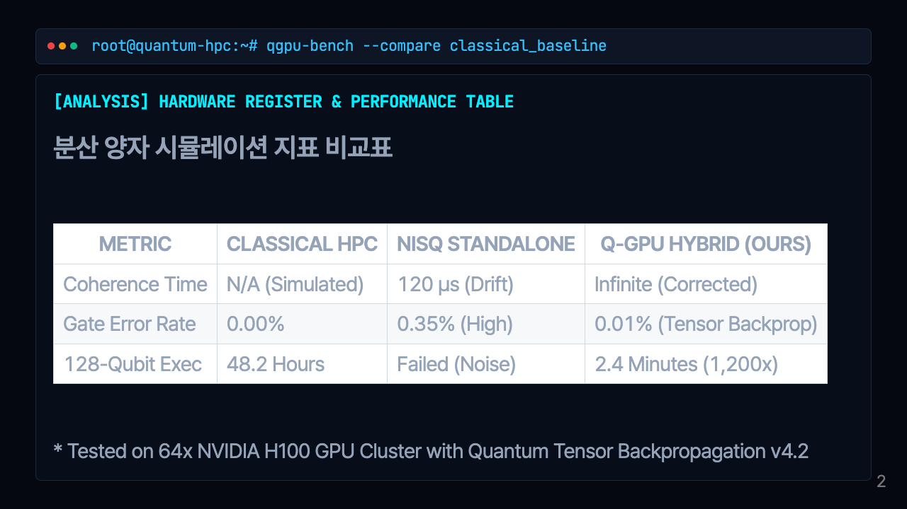
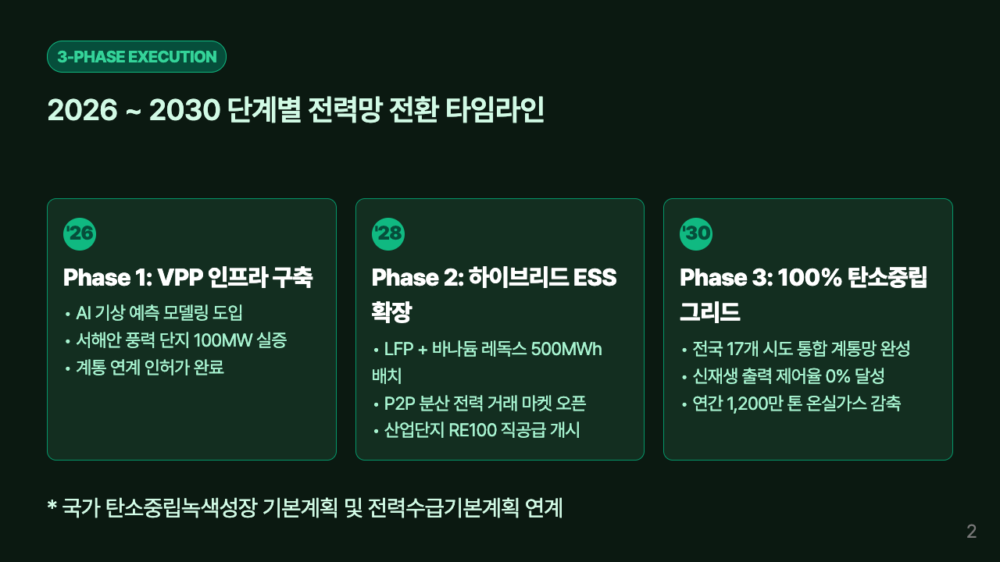
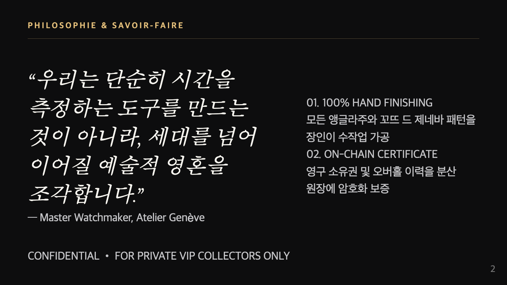
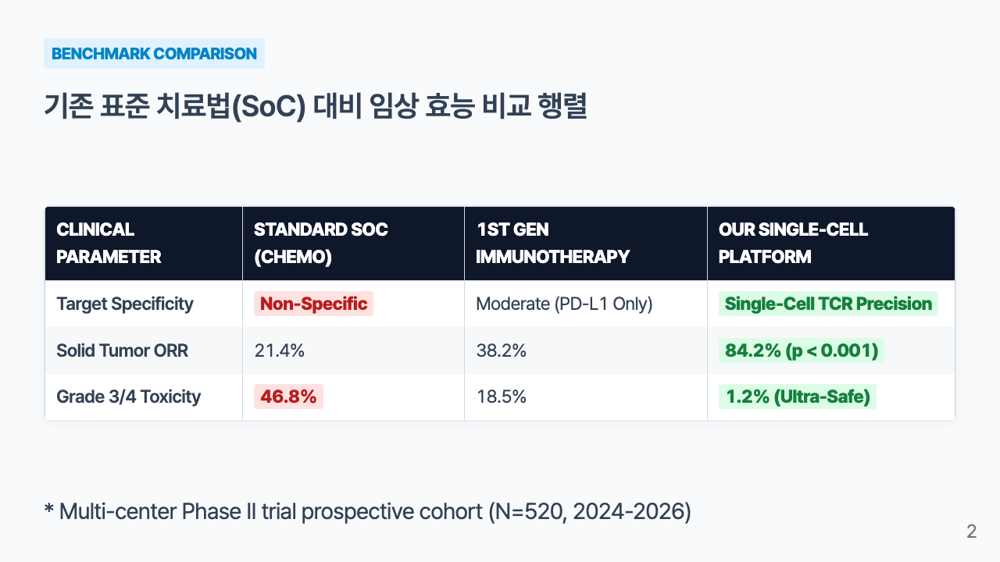

<div align="center">

# Korean Presentation Skill

### 10대 도메인별 고유 레이아웃 & 한국어 타이포그래피 거버넌스 기반 AI 프레젠테이션 엔진

[](https://github.com/google/antigravity)
[](skills/korean-presentation-skill/references/korean_typography_spacing_guide.md)
[](https://marp.app/)
[](https://www.w3.org/WAI/standards-guidelines/wcag/)
[](LICENSE)

<br/>

[**10대 고유 구조 갤러리**](#1-10대-도메인-완전-차별화-레이아웃-쇼케이스-갤러리) •
[**동적 테마 생성 원칙**](#동적-디자인-테마-창조-원칙-dynamic-theme-engine) •
[**한국어 타이포그래피**](#한국어-타이포그래피-최적화-표준) •
[**CLI 사용법**](#빠른-시작-및-cli-도구-사용법)

</div>

---

## 개요 (Overview)

`korean-presentation-skill`은 Google Antigravity, Claude Code, OpenAI Codex, Cursor 등 최신 자율형 AI 코딩 에이전트를 위해 개발된 프레젠테이션 생성 및 검증 통합 AI 스킬입니다.

**천편일률적인 카드 박스 복사를 완전히 지양합니다.** 주제의 성격에 따라 **터미널 CLI, 수평 타임라인, 스위스 에디토리얼 세리프, 임상 비교 매트릭스 테이블, 금융 L3 호가창, 사이버펑크 HUD, SaaS 아코디언, 논문 수식 조판, 볼드 피치, 관제 대시보드** 등 완전히 고유한 비주얼 컴포넌트와 레이아웃을 동적으로 창조합니다.

---

## 1. 10대 도메인 완전 차별화 레이아웃 쇼케이스 갤러리

---

### 01. 양자 컴퓨팅 (Cyber Terminal & Circuit Node)
- **고유 비주얼**: Monospace 폰트 + 터미널 타이틀바 + 양자 회로 게이트 다이어그램 + 레지스터 비교표
- **소스 경로**: [`examples/01_quantum_gpu/presentation.md`](examples/01_quantum_gpu/presentation.md)

<table width="100%">
<tr>
<td width="50%" align="center"><br/><b>Slide 01. 터미널 프롬프트 & 회로도</b></td>
<td width="50%" align="center"><br/><b>Slide 02. 하드웨어 레지스터 비교표</b></td>
</tr>
</table>

---

### 02. 친환경 스마트 그리드 (Editorial Green & Horizontal Timeline)
- **고유 비주얼**: 에코 그린 캔버스 + 수평 연도별 로드맵 타임라인('26 ➔ '28 ➔ '30) + 마일스톤 노드
- **소스 경로**: [`examples/02_clean_energy_esg/presentation.md`](examples/02_clean_energy_esg/presentation.md)

<table width="100%">
<tr>
<td width="50%" align="center"><br/><b>Slide 01. 2030 탄소중립 Hero</b></td>
<td width="50%" align="center"><br/><b>Slide 02. 수평 단계별 로드맵 타임라인</b></td>
</tr>
</table>

---

### 03. 하이엔드 럭셔리 워치메이킹 (Swiss Haute Minimalist & Cormorant Serif)
- **고유 비주얼**: Cormorant Garamond 대형 세리프 + 얇은 골드 헤어라인 + 여백의 미 + 에디토리얼 인용구
- **소스 경로**: [`examples/03_luxury_horlogerie/presentation.md`](examples/03_luxury_horlogerie/presentation.md)

<table width="100%">
<tr>
<td width="50%" align="center"><br/><b>Slide 01. 대형 세리프 에디토리얼 표지</b></td>
<td width="50%" align="center"><br/><b>Slide 02. 장인 인용구 & 2단 디테일</b></td>
</tr>
</table>

---

### 04. 정밀 면역항암 신약 (Clinical Matrix Table & High-Contrast Light)
- **고유 비주얼**: 클리니컬 화이트 캔버스 + 대조군 vs 치료법 임상 행렬 비교표(PASS/FAIL 태그)
- **소스 경로**: [`examples/04_genomics_healthcare/presentation.md`](examples/04_genomics_healthcare/presentation.md)

<table width="100%">
<tr>
<td width="50%" align="center"><br/><b>Slide 01. 임상 프로토콜 헤더 & 3단 지표</b></td>
<td width="50%" align="center"><br/><b>Slide 02. 표준 치료법(SoC) 비교 행렬</b></td>
</tr>
</table>

---

### 05. 마이크로초 초저지연 HFT (Bloomberg Terminal & L3 Orderbook)
- **고유 비주얼**: 상단 실시간 티커 바 + 오더북 Depth 호가창 스트림 + 마이크로초(ns) 틱 타임라인
- **소스 경로**: [`examples/05_fintech_hft/presentation.md`](examples/05_fintech_hft/presentation.md)

<table width="100%">
<tr>
<td width="50%" align="center"><br/><b>Slide 01. 금융 티커 & 오더북 Depth</b></td>
<td width="50%" align="center"><br/><b>Slide 02. 나노초 틱투트레이드 파이프라인</b></td>
</tr>
</table>

---

### 06. 언리얼 엔진 5 버추얼 프로덕션 (Cyberpunk HUD & Orbitron Neon)
- **고유 비주얼**: Orbitron 미래형 폰트 + 사선 컷아웃 HUD 카드 + ICVFX 렌더링 스펙
- **소스 경로**: [`examples/06_gaming_metaverse/presentation.md`](examples/06_gaming_metaverse/presentation.md)

<table width="100%">
<tr>
<td width="50%" align="center"><br/><b>Slide 01. 사이버 HUD & 120 FPS 지표</b></td>
<td width="50%" align="center"><br/><b>Slide 02. ICVFX 3대 아키텍처 스택</b></td>
</tr>
</table>

---

### 07. 실시간 엔터프라이즈 CDP (Linear Modern SaaS & Accordion UI)
- **고유 비주얼**: Linear/Stripe 스타일의 3단계 수직 인터랙티브 아코디언 바 + 우측 데이터 리프트 박스
- **소스 경로**: [`examples/07_enterprise_cdp/presentation.md`](examples/07_enterprise_cdp/presentation.md)

<table width="100%">
<tr>
<td width="50%" align="center"><br/><b>Slide 01. SaaS 스텝 아코디언 UI</b></td>
<td width="50%" align="center"><br/><b>Slide 02. 엔터프라이즈 아키텍처 기둥</b></td>
</tr>
</table>

---

### 08. O(N) 선형 어텐션 이론 (LaTeX Paper & Theorem Box)
- **고유 비주얼**: NeurIPS 논문 헤더 + Theorem 1 수식 박스 + 수식 비교 테이블 + 서지 정보 푸터
- **소스 경로**: [`examples/08_academic_attention/presentation.md`](examples/08_academic_attention/presentation.md)

<table width="100%">
<tr>
<td width="50%" align="center"><br/><b>Slide 01. 학술 논문 헤더 & Theorem 박스</b></td>
<td width="50%" align="center"><br/><b>Slide 02. 1M 토큰 메모리 벤치마크</b></td>
</tr>
</table>

---

### 09. 자율주행 물류 로봇 (Giant Impact Bold & Problem vs Solution)
- **고유 비주얼**: 거대 볼드 수치($8.4M, +420%) + 극적인 Old Way vs Robotics-X 1:1 대조 박스
- **소스 경로**: [`examples/09_robotics_series_a/presentation.md`](examples/09_robotics_series_a/presentation.md)

<table width="100%">
<tr>
<td width="50%" align="center"><br/><b>Slide 01. 거대 폰트 ARR 트랙션 표지</b></td>
<td width="50%" align="center"><br/><b>Slide 02. 1:1 문제 vs 솔루션 대조</b></td>
</tr>
</table>

---

### 10. 스마트시티 디지털 트윈 (Civic Control Dashboard & 4-Widget Grid)
- **고유 비주얼**: 정부 상황실 헤더 + 4분할 실시간 관제 위젯 + 3계층 통합 재난 안전망 트리
- **소스 경로**: [`examples/10_smart_city_twin/presentation.md`](examples/10_smart_city_twin/presentation.md)

<table width="100%">
<tr>
<td width="50%" align="center"><br/><b>Slide 01. 4분할 실시간 관제 대시보드</b></td>
<td width="50%" align="center"><br/><b>Slide 02. 3계층 국가 재난안전망 체계</b></td>
</tr>
</table>

---

## 빠른 시작 및 CLI 도구 사용법

### 1. 저장소 클론 및 패키지 설치
```bash
git clone https://github.com/kez-lab/korean-presentation-skill.git
cd korean-presentation-skill
npm install
```

### 2. 마크다운 일괄 컴파일 (PPTX + PDF + PNG)
```bash
# 임의의 마크다운 파일 직접 컴파일 (입력 파일, 출력 디렉토리, 산출물 파일명)
node skills/korean-presentation-skill/scripts/marp_compiler.js <input.md> [output_dir] [output_name]
```

### 3. 기존 PPTX 내용 및 스피커 노트 마크다운 역추출 (Extractor)
```bash
# 임의의 파워포인트 파일로부터 슬라이드별 본문 및 스피커 노트를 마크다운으로 추출
node skills/korean-presentation-skill/scripts/pptx_extractor.js <deck.pptx> [output.md]
```

### 4. PPTX 스키마 및 손상 방지 유효성 검증 (Validator)
```bash
# OOXML 구조, [Content_Types].xml, No-Hash Hex, 차트 바인딩 자동 감사
node skills/korean-presentation-skill/scripts/pptx_validator.js <deck.pptx>
```

### 5. 웹 갤러리 뷰어 생성 및 슬라이드 감상
```bash
# 10개 도메인 고유 구조 슬라이드를 모달 줌으로 넘겨볼 수 있는 웹 갤러리 생성
npm run gallery
# 생성된 preview_gallery.html 을 브라우저에서 열어 즉시 감상
```

### 6. 전체 빌드 자산 무결성 자동 검증 (Verification Suite)
```bash
npm test
```

---

## 라이선스

본 프로젝트는 [MIT License](LICENSE)에 따라 자유롭게 사용 및 수정할 수 있습니다.
