<div align="center">

# Korean Presentation Skill

### 한국어 타이포그래피 최적화 및 프로 UI/UX 디자인 거버넌스 기반 AI 에이전트 프레젠테이션 엔진

[](https://github.com/google/antigravity)
[](skills/korean-presentation-skill/references/korean_typography_spacing_guide.md)
[](https://marp.app/)
[](https://www.w3.org/WAI/standards-guidelines/wcag/)
[](LICENSE)

<br/>

[**4종 템플릿 갤러리**](#1-4종-완성형-프레젠테이션-템플릿-갤러리) •
[**실전 레퍼런스 덱 쇼케이스**](#2-실전-레퍼런스-덱-쇼케이스-afsm-8-slide-session) •
[**한국어 타이포그래피**](#한국어-타이포그래피-최적화-표준) •
[**디자인 거버넌스**](#5대-핵심-디자인-거버넌스) •
[**CLI 사용법**](#빠른-시작-및-cli-사용법)

</div>

---

## 개요 (Overview)

`korean-presentation-skill`은 Google Antigravity, Claude Code, Cursor, Windsurf 등 최신 자율형 AI 코딩 에이전트를 위해 개발된 프레젠테이션 생성 전용 AI 스킬입니다.

기존 AI 슬라이드 생성 도구들이 비라틴 문자권에서 자주 일으키는 **헐거운 자간 분산, 어색한 음절 분절, 외톨이 조사 고립, 상단 쏠림 현상(Top-Heavy Clutter), 복구 오류가 발생하는 손상된 파워포인트 파일** 문제를 근본적으로 해결합니다.

순수 마크다운(Markdown) 문서 하나로부터 다음 3가지 핵심 산출물을 동시에 컴파일하여 생성합니다:

1. **파워포인트 원본 (`.pptx`)**: 네이티브 벡터 셰이프와 텍스트를 유지하며, 복구 오류 0%를 보장합니다.
2. **벡터 PDF (`.pdf`)**: 고해상도 인쇄 및 고객사 공식 배포에 최적화된 인쇄용 문서입니다.
3. **1920×1080 고화질 이미지 (`.png`)**: AI 에이전트가 자체 비전 도구(`view_file`)를 통해 시각적 레이아웃과 클리핑 여부를 자율 검증(Self-Correction)할 수 있는 렌더링 결과물입니다.

---

## 1. 4종 완성형 6-Slide 풀 프레젠테이션 템플릿

각 도메인별로 **표지, 목차, 문제 정의, 파이프라인/전략, 벤치마크/비교, 결론 및 Q&A 허브**까지 완벽히 갖춘 6슬라이드 실전 프로덕션 템플릿입니다.

---

### 템플릿 01. Tech Dark Glass (테크 & 분산 시스템 아키텍처)
- **추천 용도**: 개발자 기술 세션, 분산 시스템 설계, 클라우드 아키텍처, 엔지니어링 딥다이브
- **디자인 특징**: 다크 글래스모피즘 표면, 24px 네온 서클 뱃지(시안/퍼플/블루/그린), 수평 4단계 스트리밍 파이프라인, Q&A 허브
- **템플릿 소스**: [`templates/01_tech_dark_glass.md`](templates/01_tech_dark_glass.md)

<table width="100%">
<tr>
<td width="50%" align="center">
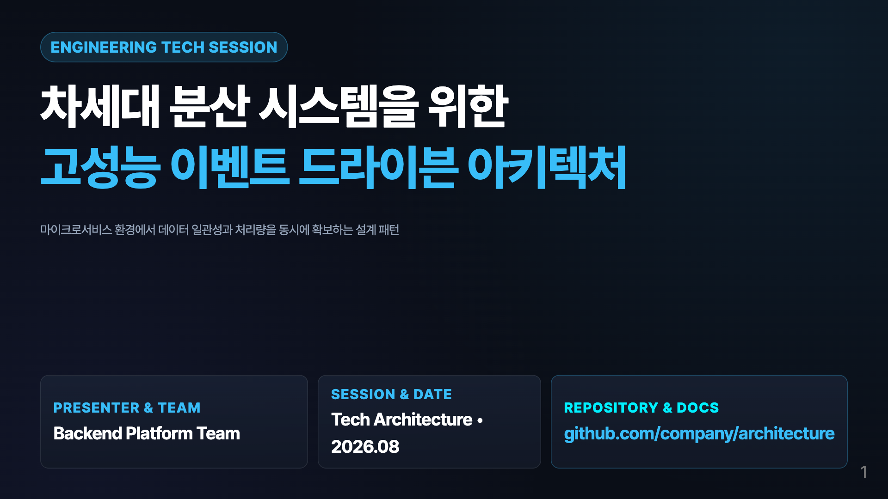<br/>
<b>Slide 01. 표지 (3-Chip Meta Hero Cover)</b>
</td>
<td width="50%" align="center">
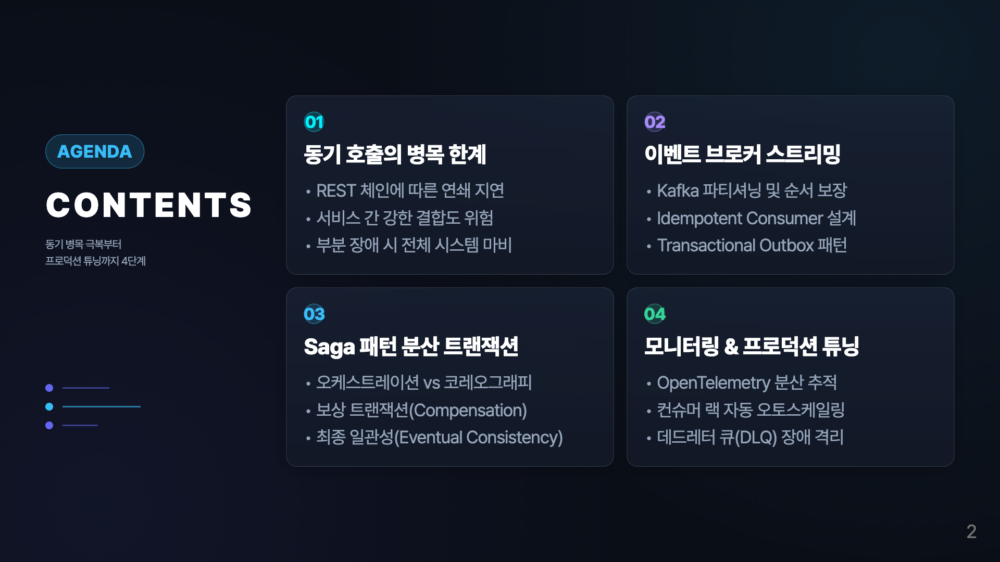<br/>
<b>Slide 02. 목차 (32:68 Asymmetric Split Agenda)</b>
</td>
</tr>
<tr>
<td width="50%" align="center">
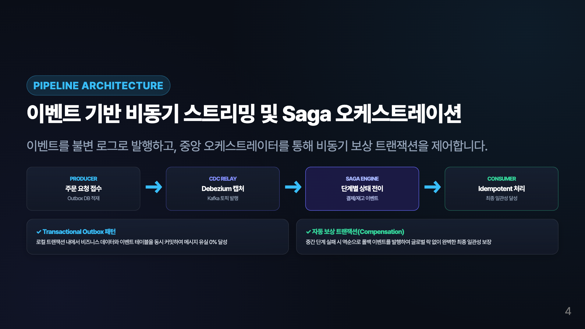<br/>
<b>Slide 04. 아키텍처 (Horizontal Pipeline & 2-Col Roles)</b>
</td>
<td width="50%" align="center">
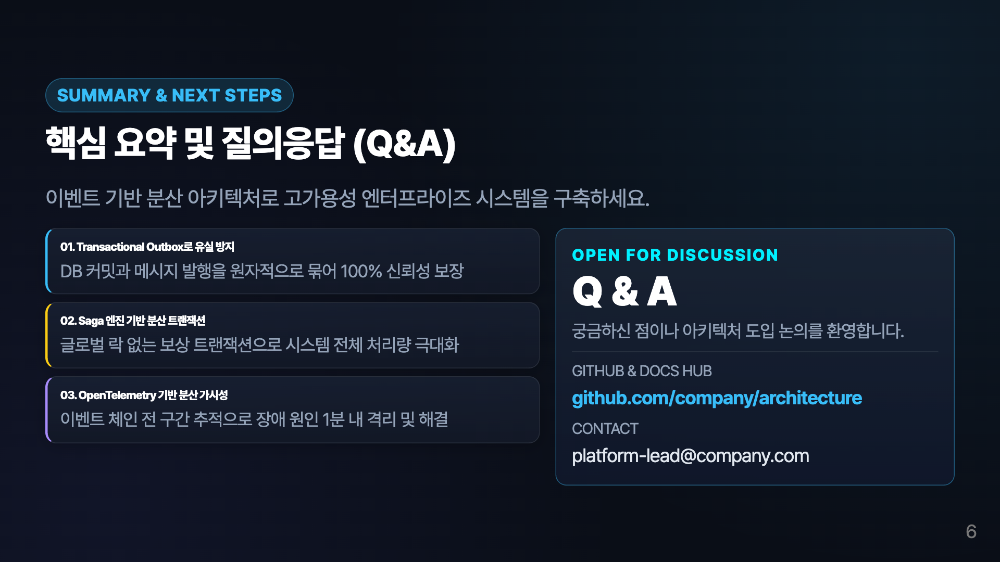<br/>
<b>Slide 06. 결론 (Takeaways & Q&A / Docs Hub)</b>
</td>
</tr>
</table>

---

### 템플릿 02. Business Clean Navy (기업 전략 & IR 경영 보고서)
- **추천 용도**: C-Level 경영진 보고, 신규 사업 전략, 분기 실적 발표, 엔터프라이즈 GTM
- **디자인 특징**: 딥 미드나잇 네이비 캔버스, 샴페인 골드 포인트, 3대 재무 Big Stats, 세일즈 퍼널 분석
- **템플릿 소스**: [`templates/02_business_clean_navy.md`](templates/02_business_clean_navy.md)

<table width="100%">
<tr>
<td width="50%" align="center">
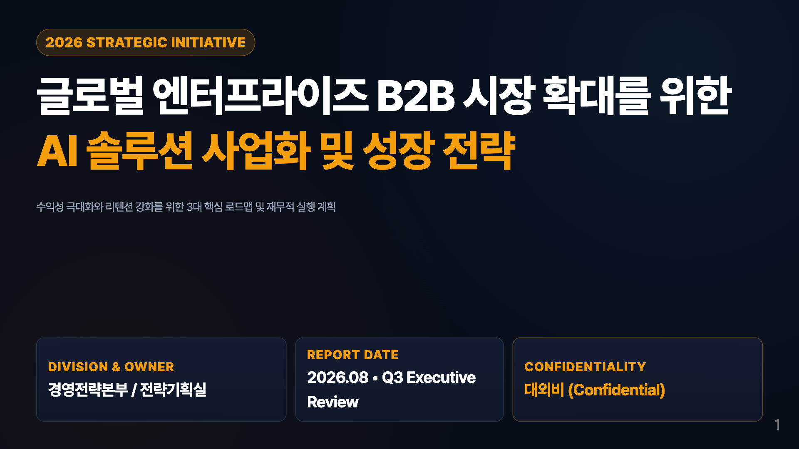<br/>
<b>Slide 01. 표지 (Strategic Initiative 3-Chip Cover)</b>
</td>
<td width="50%" align="center">
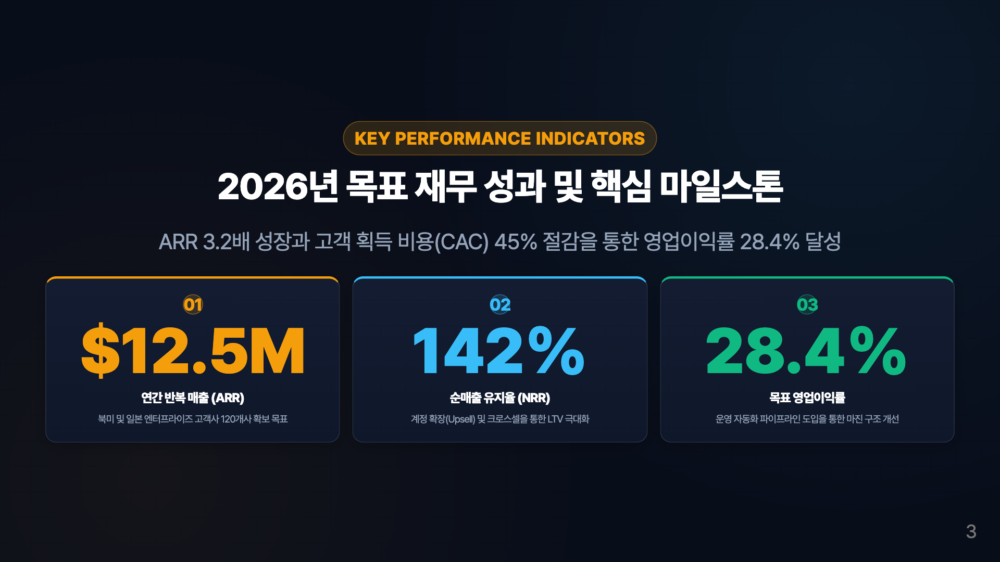<br/>
<b>Slide 03. 핵심 성과 지표 (Financial Big Stats)</b>
</td>
</tr>
<tr>
<td width="50%" align="center">
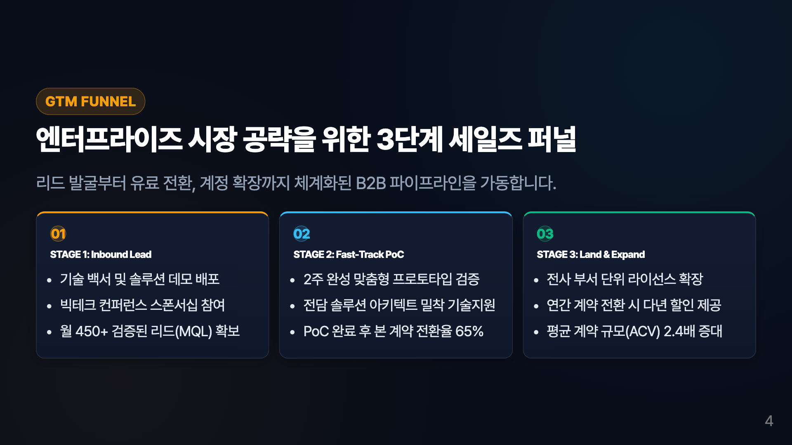<br/>
<b>Slide 04. GTM 전략 (3-Stage B2B Sales Funnel)</b>
</td>
<td width="50%" align="center">
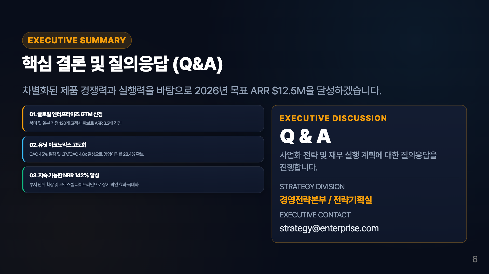<br/>
<b>Slide 06. 결론 (Executive Summary & Q&A)</b>
</td>
</tr>
</table>

---

### 템플릿 03. Modern Light (학술 대회 & 논문 연구 & 백서)
- **추천 용도**: 학회 논문 발표, 연구 성과 보고, 인쇄용 백서(Whitepaper) 배포
- **디자인 특징**: 오프화이트 캔버스, 딥 인디고 & 마린 블루, 3단계 모델 경량화 파이프라인, 비교 벤치마크 매트릭스
- **템플릿 소스**: [`templates/03_modern_light.md`](templates/03_modern_light.md)

<table width="100%">
<tr>
<td width="50%" align="center">
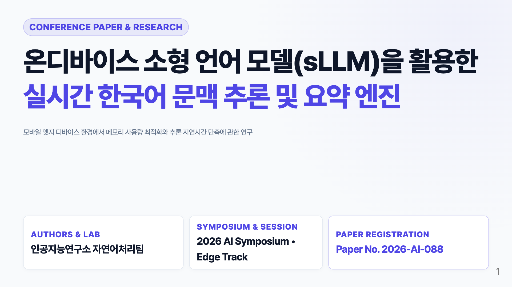<br/>
<b>Slide 01. 표지 (Research Paper 3-Chip Cover)</b>
</td>
<td width="50%" align="center">
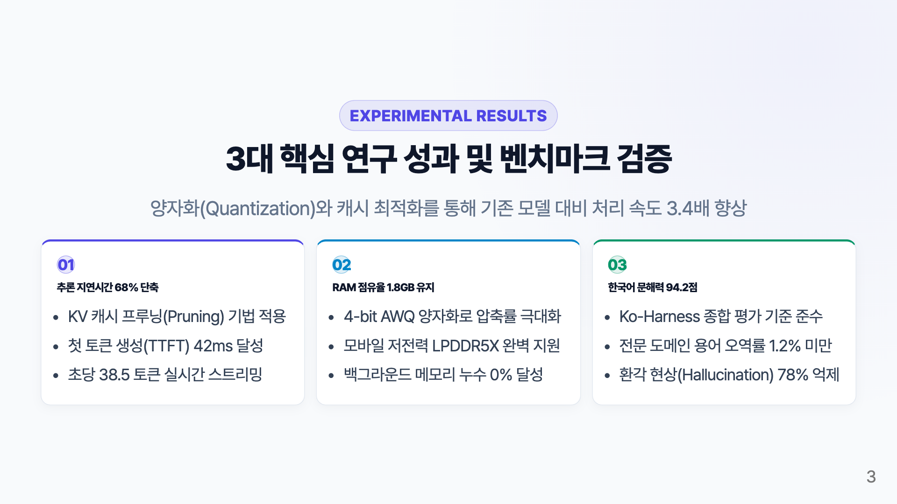<br/>
<b>Slide 03. 연구 성과 (3-Card Benchmark Findings)</b>
</td>
</tr>
<tr>
<td width="50%" align="center">
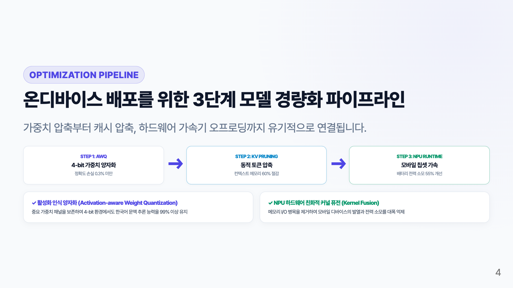<br/>
<b>Slide 04. 경량화 파이프라인 (3-Step Optimization)</b>
</td>
<td width="50%" align="center">
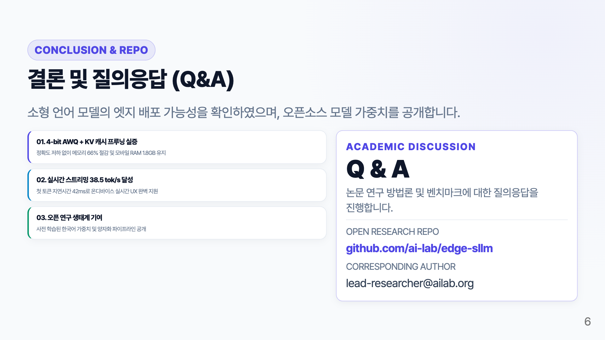<br/>
<b>Slide 06. 결론 (Academic Conclusion & Research Repo)</b>
</td>
</tr>
</table>

---

### 템플릿 04. Pitch Keynote Bold (스타트업 피치 덱 & 프로덕트 런칭)
- **추천 용도**: Series A/B 투자 유치 피치, 데모데이 발표, 신제품 런칭 키노트
- **디자인 특징**: 매트 옵시디언 블랙, 일렉트릭 골드, 대형 트랙션 지표, 패러다임 전환 쿼트, 투자 유치 Q&A 허브
- **템플릿 소스**: [`templates/04_pitch_keynote_bold.md`](templates/04_pitch_keynote_bold.md)

<table width="100%">
<tr>
<td width="50%" align="center">
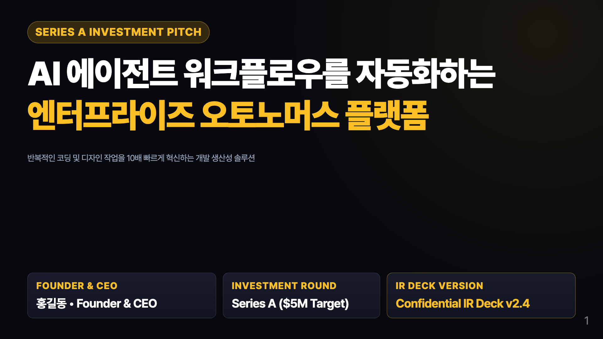<br/>
<b>Slide 01. 표지 (Investment Pitch 3-Chip Cover)</b>
</td>
<td width="50%" align="center">
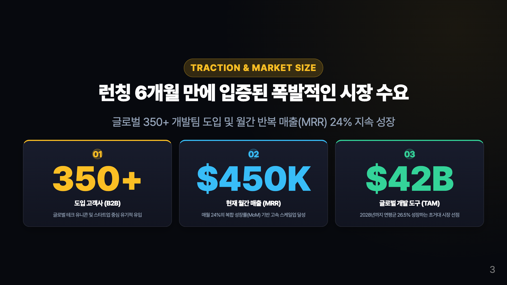<br/>
<b>Slide 03. 트랙션 & 시장 규모 (Giant Traction Metrics)</b>
</td>
</tr>
<tr>
<td width="50%" align="center">
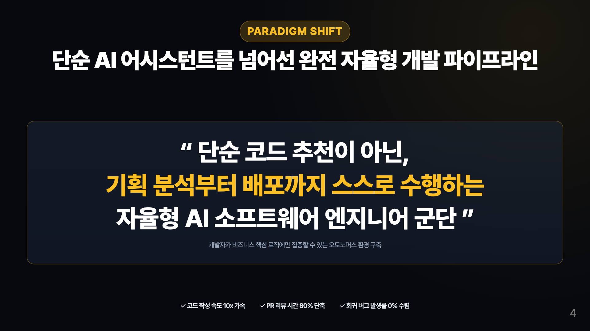<br/>
<b>Slide 04. 제품 비전 (Paradigm Shift & 3 Pillars)</b>
</td>
<td width="50%" align="center">
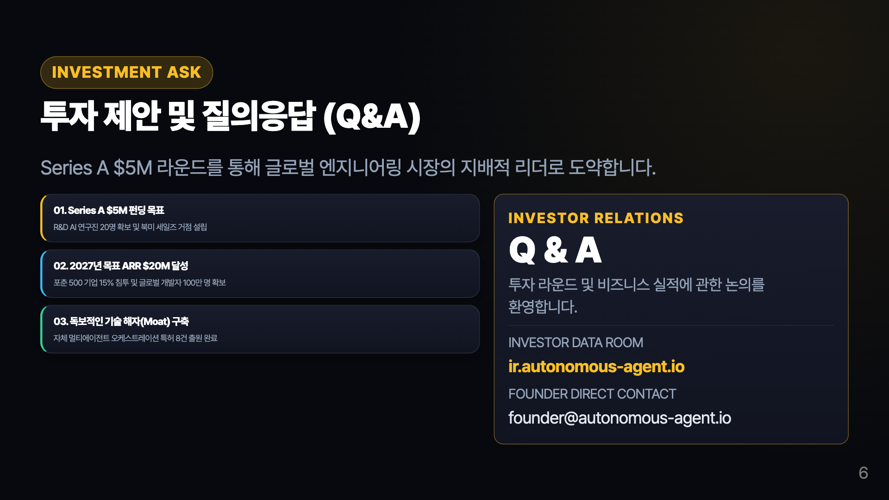<br/>
<b>Slide 06. 결론 (Series A Ask & Investor Q&A Hub)</b>
</td>
</tr>
</table>

---

## 2. 실전 레퍼런스 덱 쇼케이스 (AFSM 8-Slide Session)

`korean-presentation-skill`의 거버넌스를 완벽히 적용하여 컴파일된 **AFSM (Android Finite State Machine) 기술 세션** 8개 슬라이드 전체 갤러리입니다:

<table width="100%">
<tr>
<td width="50%" align="center">
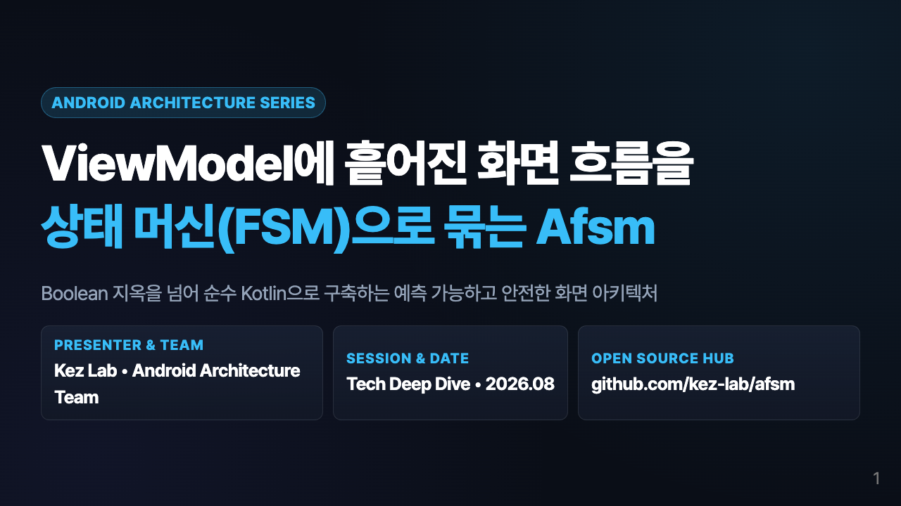<br/>
<b>Slide 01. 표지 (Hero Cover)</b><br/>
<sub>Space-Between Gravity • 대형 타이포그래피 • 메타데이터 배너</sub>
</td>
<td width="50%" align="center">
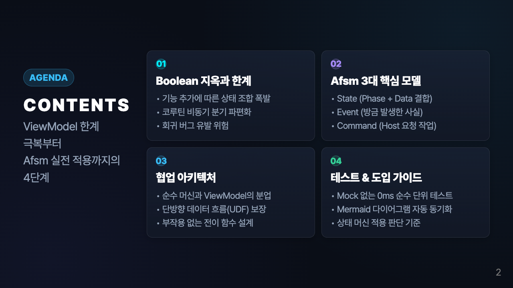<br/>
<b>Slide 02. 목차 (32:68 비대칭 2단 분할)</b><br/>
<sub>48px 안전 여백 • 2x2 글래스모피즘 카드 • 01~04 네온 뱃지</sub>
</td>
</tr>
<tr>
<td width="50%" align="center">
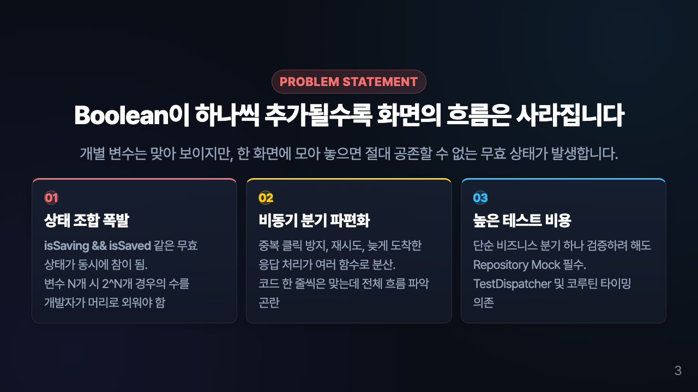<br/>
<b>Slide 03. 문제점 진단 (Problem Statement)</b><br/>
<sub>상단 3.5px 컬러 보더 • 3단 카드 그리드 • 고대비 텍스트</sub>
</td>
<td width="50%" align="center">
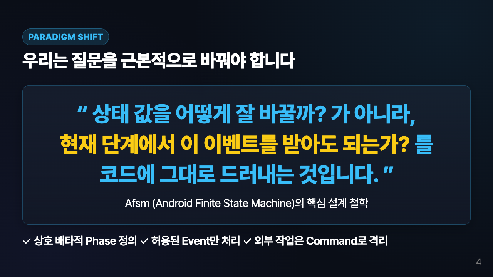<br/>
<b>Slide 04. 패러다임 전환 (Quote Focus)</b><br/>
<sub>수직 중앙 집중 • 시안 & 옐로우 네온 하이라이트 • 체크리스트</sub>
</td>
</tr>
<tr>
<td width="50%" align="center">
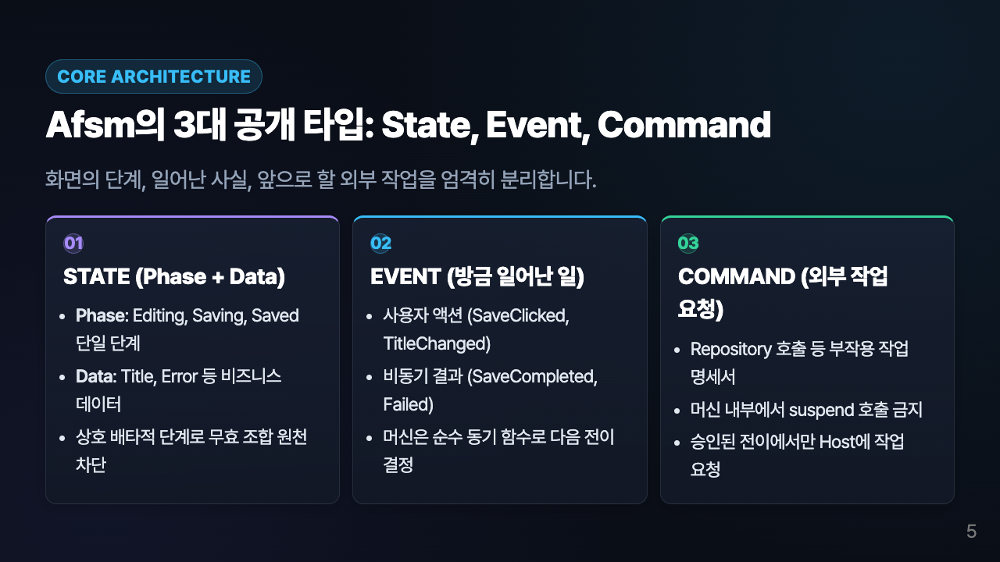<br/>
<b>Slide 05. 3대 핵심 모델 (Core Architecture)</b><br/>
<sub>퍼플/블루/그린 시그니처 보더 • 모듈러 불릿 • 정밀 마진</sub>
</td>
<td width="50%" align="center">
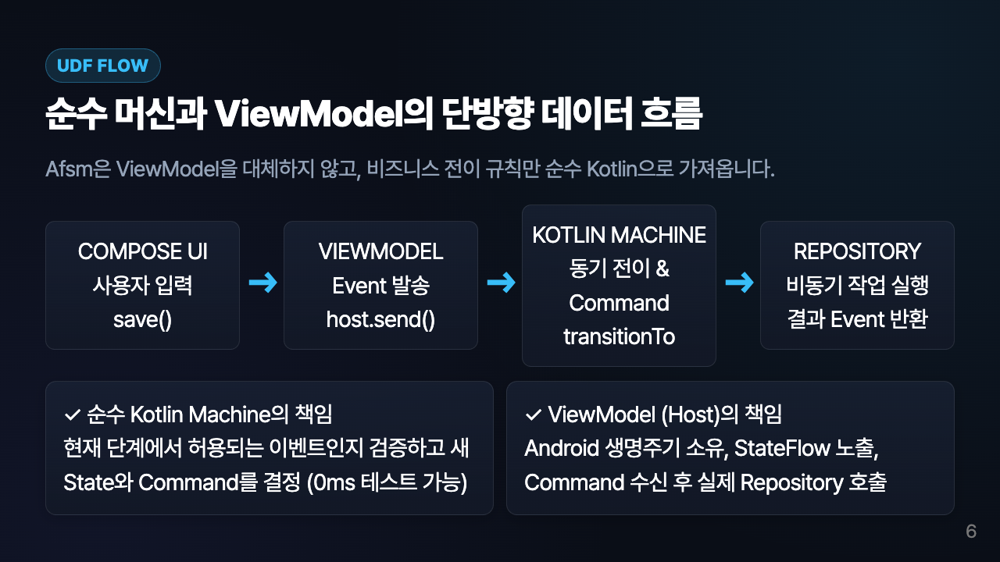<br/>
<b>Slide 06. 단방향 데이터 흐름 (UDF Flow)</b><br/>
<sub>수평 4단계 파이프라인 • 네온 커넥터 • 2단 역할 분담 카드</sub>
</td>
</tr>
<tr>
<td width="50%" align="center">
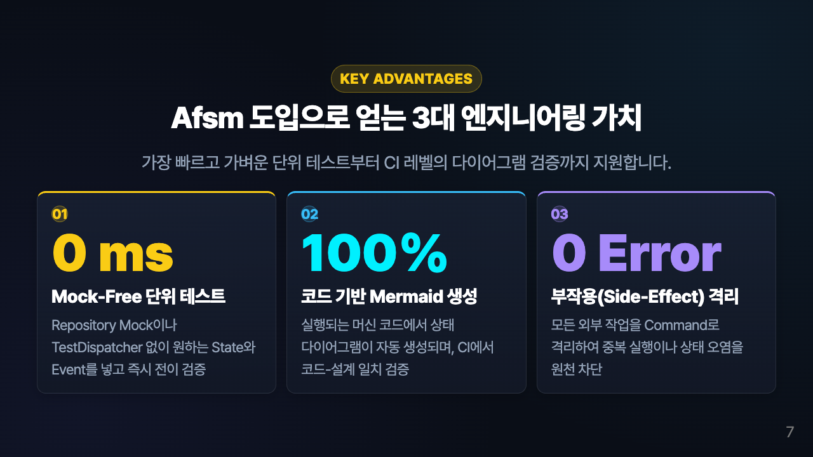<br/>
<b>Slide 07. 3대 엔지니어링 가치 (Big Stats)</b><br/>
<sub>0ms 옐로우 • 100% 시안 • 0 Error 퍼플 • 대형 KPI 수치</sub>
</td>
<td width="50%" align="center">
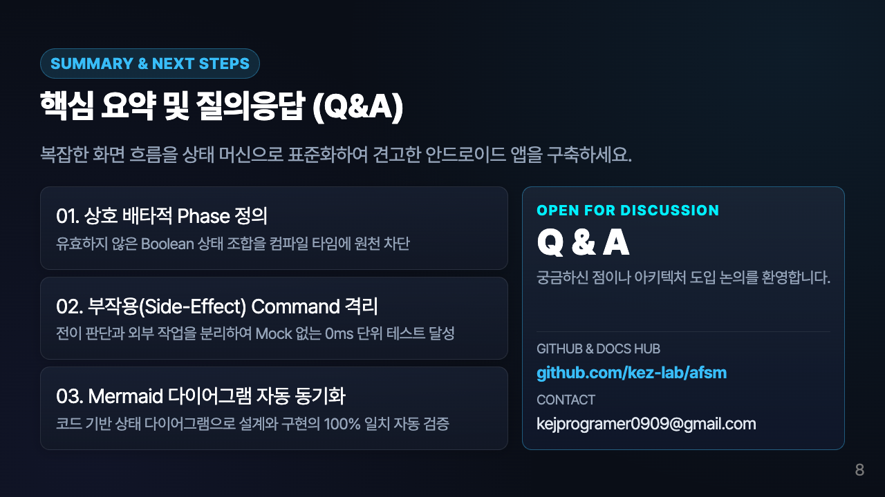<br/>
<b>Slide 08. 요약 및 액션 (Summary & CTA)</b><br/>
<sub>3단 핵심 요약 카드 • 공식 저장소 링크 및 Q&A 배너</sub>
</td>
</tr>
</table>

---

## AI 에이전트 자율 워크플로우

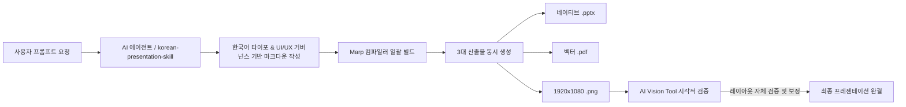
```mermaid
flowchart LR
    A[사용자 프롬프트 요청] --> B[AI 에이전트 / korean-presentation-skill]
    B --> C[한국어 타이포 & UI/UX 거버넌스 기반 마크다운 작성]
    C --> D[Marp 컴파일러 일괄 빌드]
    D --> E[3대 산출물 동시 생성]
    E --> E1[네이티브 .pptx]
    E --> E2[벡터 .pdf]
    E --> E3[1920x1080 .png]
    E3 --> F[AI Vision Tool 시각적 검증]
    F -->|레이아웃 자체 검증 및 보정| G[최종 프레젠테이션 완결]
```

1. **검증된 레이아웃 참조 (Layout Catalog)**: AI 에이전트는 [layout_catalog.md](skills/korean-presentation-skill/references/layout_catalog.md)에 정의된 20개 이상의 검증된 레이아웃 패턴(비대칭 분할, 3대 모델 기둥, 4단계 파이프라인, 빅 스탯 지표 등)을 선택하여 슬라이드를 설계합니다.
2. **자율 시각 검증 루프 (Self-Correction Loop)**: 슬라이드 컴파일 직후, AI 에이전트는 생성된 고해상도 이미지(`slides_preview/slide.*.png`)를 확인하여 컴포넌트 간 겹침, 여백 불균형, 텍스트 클리핑이 없는지 시각적으로 검토한 후 최종 산출물을 인도합니다.

---

## 5대 핵심 디자인 거버넌스

```
┌────────────────────────────────────────────────────────────────────────────────────────┐
│                                 디자인 거버넌스 표준 매트릭스                             │
├──────────────────────────────┬─────────────────────────────────────────────────────────┤
│ 1. Visual Center Equilibrium │ 상단 쏠림 방지, 슬라이드 수직 중심축 기준 1:1 대칭 여백    │
│ 2. Korean Typography Core    │ -0.025em 음수 자간, word-break: keep-all, 외톨이 조사 방지│
│ 3. Dark Glassmorphism        │ 60-30-10 컬러 룰 + 24px 네온 마이크로 뱃지 시스템        │
│ 4. Harmonious 8pt Spacing    │ 20px 22px 카드 패딩, 24~28px 계층 분리 마진             │
│ 5. Anti-Occlusion Layout     │ 640px 가용 뷰포트 높이 예산제 적용으로 겹침/클리핑 0% 보장│
└──────────────────────────────┴─────────────────────────────────────────────────────────┘
```

### 1. Visual Center Equilibrium (수직 중앙 밸런스)
무비판적인 `justify-content: flex-start`로 인해 콘텐츠가 상단 천장에 다닥다닥 붙고 하단이 휑하게 비는 상단 쏠림(Top-Heavy Clutter)을 차단합니다. 기본 정렬을 `justify-content: center`로 유지하여 상하 호흡 여백(Breathing Zone)이 1:1 대칭을 이루도록 설계합니다.

### 2. 한국어 타이포그래피 최적화 표준
- **음수 자간 (`letter-spacing: -0.025em`)**: 정방형 한글 폰트의 헐거운 분산감을 제거하고 고밀도 텍스트 응집력을 제공합니다.
- **어절 보존 (`word-break: keep-all;`)**: 한글 단어가 음절 중간에서 부자연스럽게 잘리지 않도록 강제합니다.
- **외톨이 조사 고립 방지**: 문장 끝의 조사("은/는/이/가/을/를/의/에")가 다음 줄에 홀로 떨어지지 않도록 의미 단위 줄바꿈을 적용합니다.
- **모듈러 행간 스케일**: 메인 타이틀 `1.28`, 섹션 제목 `1.32`, 본문 `1.55`.

### 3. 다크 글래스모피즘 & 24px 네온 뱃지
- **표면(Surface)**: `linear-gradient(180deg, rgba(26, 35, 54, 0.7) 0%, rgba(18, 24, 38, 0.95) 100%)` 및 `1px solid rgba(255, 255, 255, 0.09)` 보더.
- **마이크로 뱃지**: 24px 원형 반투명 네온 서클 뱃지(시안 `#00F0FF`, 퍼플 `#A78BFA`, 블루 `#38BDF8`, 그린 `#34D399`, 옐로우 `#FACC15`, 레드 `#F87171`).
- **WCAG AAA 고대비**: 고휘도 빔프로젝터 및 고해상도 레티나 디스플레이 환경에서도 또렷한 가독성을 제공합니다.

### 4. 8pt 모듈러 스페이싱 (Breathing Room)
카드 내부 `padding: 20px 22px` 및 그리드 `gap: 16px ~ 20px`를 준수하여 텍스트가 카드 경계선에 갇히지 않고 시원한 여백을 확보합니다.

### 5. 높이 예산제 기반 안티 클리핑 (Anti-Occlusion)
1280×720 슬라이드 캔버스 내에서 헤더와 본문 요소의 총 높이가 가용 뷰포트(640px)를 초과하지 않도록 컴포넌트 높이를 사전 계산하여 클리핑을 원천 방지합니다.

---

## 프로젝트 및 스킬 구조

```
korean-presentation-skill/
├── skills/korean-presentation-skill/  # Antigravity 전용 AI 스킬 패키지
│   ├── SKILL.md                       # 에이전트 시스템 프롬프트 및 거버넌스 지침
│   ├── references/                    # 6대 상세 디자인 레퍼런스
│   │   ├── korean_typography_spacing_guide.md # 한국어 타이포 및 여백 표준 가이드
│   │   ├── gravity_spacing_occlusion_guide.md # 수직 밸런스 및 상단 쏠림 방지 가이드
│   │   ├── ui_ux_methodologies.md             # 게슈탈트 및 UI/UX 방법론
│   │   ├── layout_catalog.md                  # 20+ 레이아웃 카탈로그
│   │   ├── design_systems.md                  # 컬러 팔레트 및 글래스 토큰
│   │   └── storytelling_framework.md          # 5단계 내러티브 프레임워크
│   └── scripts/
│       ├── marp_compiler.js               # PPTX + PDF + PNG 통합 컴파일러
│       └── slide_engine.py                # 파이썬 슬라이드 보조 스크립트
│
├── templates/                             # 4종 완성형 프레젠테이션 템플릿
│   ├── 01_tech_dark_glass.md              # 테크 아키텍처 템플릿
│   ├── 02_business_clean_navy.md          # 기업 전략 / IR 템플릿
│   ├── 03_modern_light.md                 # 학술 / 연구 / 라이트 템플릿
│   ├── 04_pitch_keynote_bold.md           # 스타트업 피치 / 키노트 템플릿
│   └── preview_*/                         # 템플릿별 1920x1080 렌더링 이미지
│
├── examples/afsm/                         # 실전 프로덕션 레퍼런스 덱 (AFSM)
│   ├── afsm_presentation.md               # 마크다운 원본 소스
│   ├── Afsm_Presentation.pptx             # 네이티브 파워포인트 원본
│   ├── Afsm_Presentation.pdf              # 벡터 PDF
│   └── slides_preview/                    # 1920x1080 슬라이드 렌더링 이미지
│
├── scripts/
│   └── compile_all_templates.js           # 4종 템플릿 일괄 컴파일 스크립트
├── package.json
├── LICENSE
└── README.md
```

---

## 빠른 시작 및 CLI 도구 사용법

### 1. 저장소 클론 및 패키지 설치
```bash
git clone https://github.com/kez-lab/korean-presentation-skill.git
cd korean-presentation-skill
npm install
```

### 2. 새 프레젠테이션 덱 생성 (Scaffolder CLI)
```bash
# 4종 템플릿 기반 새 발표 자료 생성 및 즉시 컴파일
node scripts/create_presentation.js --theme business --title "2026 AI 신사업 전략" --author "홍길동 전략기획실장" --out business_deck.md --compile

# 또는 대화형 옵션 확인
npm run create -- --help
```

### 3. 프레젠테이션 일괄 컴파일 (PPTX + PDF + PNG)
```bash
# 임의의 마크다운 파일 직접 컴파일 (입력 파일, 출력 디렉토리, 산출물 파일명)
node skills/korean-presentation-skill/scripts/marp_compiler.js <input.md> [output_dir] [output_name]

# 4종 도메인 템플릿(24 Slides) 일괄 컴파일
npm run build:templates

# 실전 레퍼런스(AFSM 8 Slides) 덱 컴파일
npm run build:example
```

### 4. 전체 42개 빌드 자산 무결성 자동 검증 (Verification Suite)
```bash
npm test
```

### 컴파일 산출물:
- `<output_dir>/<output_name>.pptx` (파워포인트 원본)
- `<output_dir>/<output_name>.pdf` (벡터 PDF)
- `<output_dir>/slides_preview/slide.001.png ~ slide.NNN.png` (1920×1080 슬라이드 이미지)

---

## Antigravity AI Agent Skill 설치 방법

본 스킬을 **Google Antigravity** 환경에 설치하여 상시 사용하려면 다음 명령어를 실행합니다:

```bash
mkdir -p ~/.gemini/config/skills/korean-presentation-skill
cp -r skills/korean-presentation-skill/* ~/.gemini/config/skills/korean-presentation-skill/
```

### AI 에이전트 호출 프롬프트 예시:
> "korean-presentation-skill을 활용해서 [발표 주제]에 관한 8슬라이드 발표 자료를 작성해줘. 한국어 타이포그래피와 다크 글래스모피즘 디자인 거버넌스를 준수하고 PPTX, PDF, PNG로 컴파일해줘."

---

## 라이선스

본 프로젝트는 [MIT License](LICENSE)에 따라 자유롭게 사용 및 수정할 수 있습니다.
