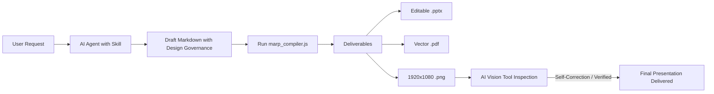
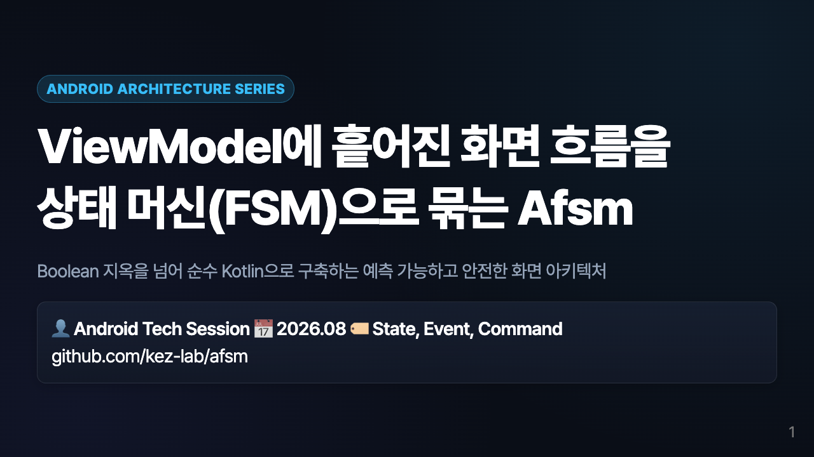
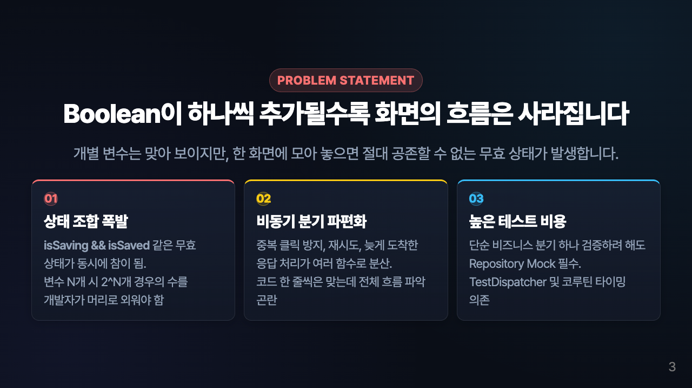
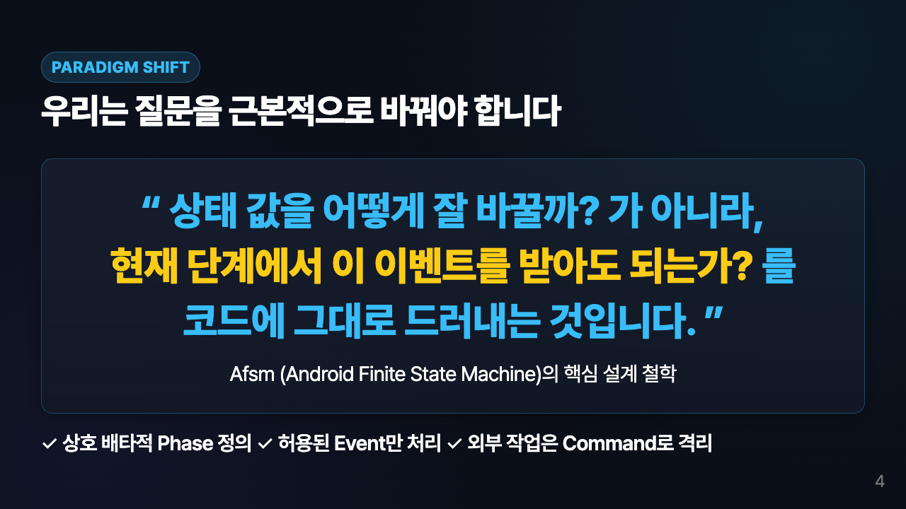
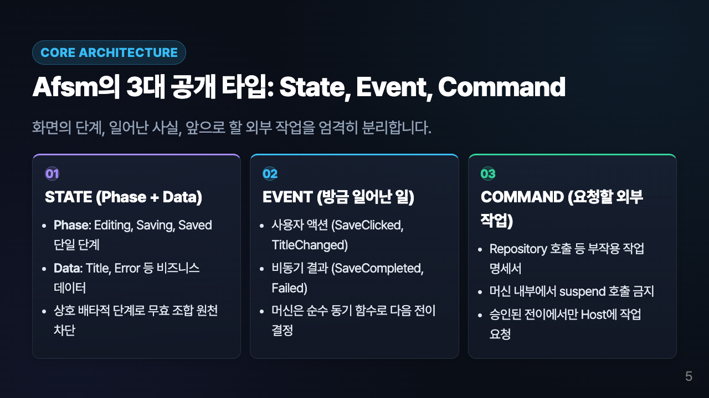
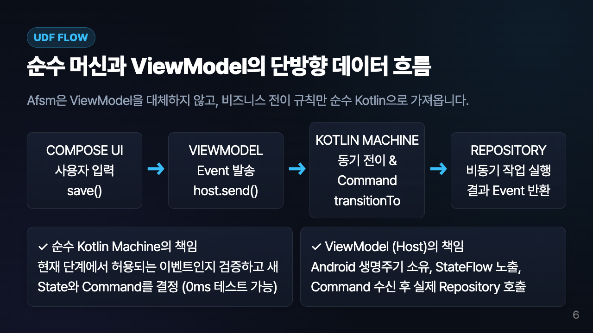
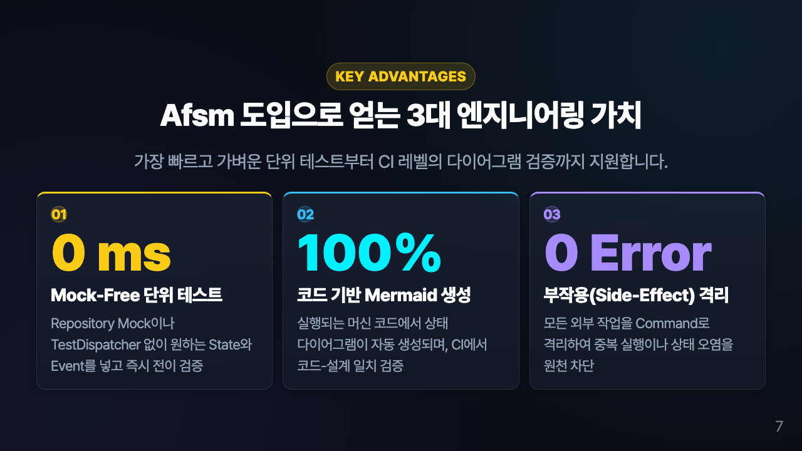
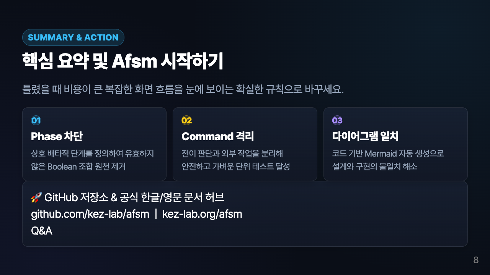

<div align="center">

# 🪄 Presentation Master (AI Agent Skill)

### Autonomous AI Skill for Generating Consulting-Grade Presentations, Print-Ready PDFs, and Verified Slide Screenshots

[](https://github.com/google/antigravity)
[](https://marp.app/)
[](https://www.w3.org/WAI/standards-guidelines/wcag/)
[](LICENSE)

<br/>

[**Live Slide Gallery**](#-verified-output-showcase) •
[**AI Agent Workflow**](#-how-ai-agents-use-this-skill) •
[**Design Governance**](#-5-pillars-of-pro-design-governance) •
[**Quick Start**](#-quick-start--cli-usage) •
[**Installation**](#-install-as-an-ai-skill)

</div>

---

## 🌟 What is Presentation Master?

**`presentation-master`** is a specialized **AI Agent Skill** built for autonomous coding assistants (Google Antigravity, Claude Code, Cursor, Windsurf, and custom LLM agents).

Unlike generic AI presentation generators that produce broken layouts, illegible low-contrast text, and corrupted PPTX files, **Presentation Master enforces rigorous UI/UX design governance, cognitive psychology principles (Gestalt), modular spacing, and multilingual typography.**

From a single Markdown file, the skill compiles **3 production-grade deliverables simultaneously**:
1. 📊 **100% Native Editable PowerPoint (`.pptx`)**: Clean native vector shapes with **0% recovery/repair errors**.
2. 📄 **Print-Ready Vector PDF (`.pdf`)**: Crystal-clear typography for client deliverables.
3. 🖼️ **1920×1080 High-Res Slide Images (`.png`)**: Enables autonomous visual inspection and validation by the AI agent via vision tools.

---

## 🤖 How AI Agents Use This Skill



### 1. Zero Hallucination Layouts
The AI Agent refers to [`layout_catalog.md`](skills/presentation-master/references/layout_catalog.md) to select from **20+ verified layout recipes** (Asymmetric Split, 3-Pillar Glassmorphism, 4-Step UDF Pipelines, Big Stat KPI Metrics, Quote Focus).

### 2. Autonomous Visual Verification Loop
After compiling the deck, the AI Agent uses its `view_file` vision tool to visually inspect each rendered PNG slide for text clipping, overlap, and visual balance before delivering to the user.

---

## 🏛️ 5 Pillars of Pro Design Governance

```
┌─────────────────────────────────────────────────────────────────────────────────────────┐
│                                 DESIGN GOVERNANCE MATRIX                                │
├──────────────────────────────┬──────────────────────────────────────────────────────────┤
│ 1. Visual Center Equilibrium │ Eliminates top-heavy clutter; 1:1 vertical padding balance│
│ 2. Multilingual Typography   │ -0.025em letter-spacing, keep-all word preservation, etc.│
│ 3. Dark Glassmorphism        │ 60-30-10 rule + 24px neon micro-badges for instant focus │
│ 4. Harmonious 8pt Spacing    │ 20px 22px card padding, 26px tier-separation margin      │
│ 5. Anti-Occlusion Layout     │ 0% overlap/clipping guaranteed via strict height budgets │
└──────────────────────────────┴──────────────────────────────────────────────────────────┘
```

### 1. ⚖️ Visual Center Equilibrium (Balanced Vertical Gravity)
- Replaces naive top-alignment (`justify-content: flex-start`) with **`justify-content: center`**.
- Content blocks float naturally along the **Visual Center Axis**, establishing balanced 1:1 top/bottom breathing zones.

### 2. 🇰🇷 Korean & Multilingual Typography Optimization
- **Negative Letter Spacing (`letter-spacing: -0.025em`)**: Eliminates loose glyph dispersion in Hangul and CJK fonts.
- **Word-Break Protection (`word-break: keep-all;`)**: Prevents words from breaking awkwardly mid-character.
- **Orphan Prevention**: Semantic line-breaks protect trailing particles (e.g., "을/를", "이/가") from dropping alone to new lines.
- **Modular Scale**: Title `2.6rem` (1.28 line-height) | Body `0.78rem ~ 0.82rem` (1.5 line-height).

### 3. 🔮 Dark Glassmorphism & 24px Micro-Badges
- **Surface**: `linear-gradient(180deg, rgba(26, 35, 54, 0.7) 0%, rgba(18, 24, 38, 0.95) 100%)` with `1px rgba(255, 255, 255, 0.09)` border.
- **Micro-Badges**: 24px circular translucent badges (`01`, `02`, `03`) with neon accents (Cyan `#00F0FF`, Purple `#A78BFA`, Blue `#38BDF8`, Green `#34D399`, Yellow `#FACC15`, Red `#F87171`).
- **WCAG AAA Compliance**: High-contrast text palette (`#FFFFFF` to `#E2E8F0`) ensures flawless legibility on high-lumen projectors and retina screens.

### 4. 📐 8pt Grid & Breathing Room
- Generous card padding (`padding: 20px 22px`) and grid gutters (`gap: 16px ~ 20px`) prevent crowded text blocks.

### 5. 🛡️ Zero-Collision Layout (Anti-Occlusion)
- All slides strictly budget height within the **640px usable viewport** (1280×720 canvas), eliminating vertical clipping and overflow.

---

## 🖼️ Verified Output Showcase

*Live renders generated by `presentation-master` for **AFSM (Android Finite State Machine)** session:*

<table width="100%">
<tr>
<td width="50%" align="center">
<br/>
<b>Slide 01. Hero Cover</b><br/>
<sub>Between Gravity • Bold Title Hierarchy • Glassmorphic Metadata Pill</sub>
</td>
<td width="50%" align="center">
<br/>
<b>Slide 02. Agenda (32:68 Asymmetric Split)</b><br/>
<sub>Anti-Clipping 48px Gutter • 2x2 Glassmorphism Cards with Neon Badges</sub>
</td>
</tr>
<tr>
<td width="50%" align="center">
<br/>
<b>Slide 03. Problem Statement</b><br/>
<sub>Red/Yellow/Blue Top Accents • High-Contrast Numbering • 3-Card Grid</sub>
</td>
<td width="50%" align="center">
<br/>
<b>Slide 04. Paradigm Shift Quote</b><br/>
<sub>Center Focus Gravity • Cyan & Gold Neon Highlights • Feature Checklist</sub>
</td>
</tr>
<tr>
<td width="50%" align="center">
<br/>
<b>Slide 05. Core Architecture 3 Pillars</b><br/>
<sub>Purple/Blue/Green Signature Borders • Modular Bullet Points • 24px Badges</sub>
</td>
<td width="50%" align="center">
<br/>
<b>Slide 06. UDF Data Flow Pipeline</b><br/>
<sub>Horizontal 4-Step Pipeline • Arrow Connectors • 2-Row Role Division</sub>
</td>
</tr>
<tr>
<td width="50%" align="center">
<br/>
<b>Slide 07. Big Stats & Metrics</b><br/>
<sub>0ms Yellow • 100% Cyan • 0 Error Purple • Giant KPI Typography</sub>
</td>
<td width="50%" align="center">
<br/>
<b>Slide 08. Summary & Call-To-Action</b><br/>
<sub>3 Takeaway Cards • Interactive GitHub & Q&A Action Banner</sub>
</td>
</tr>
</table>

---

## 📦 Project & Skill Structure

```
presentation-master/
├── 📁 skills/presentation-master/         # AI Agent Skill Package
│   ├── 📜 SKILL.md                       # Agent System Prompt & Governance Rules
│   ├── 📁 references/                    # Engineering Reference Guides
│   │   ├── gravity_spacing_occlusion_guide.md # Visual Center & Spacing Standards
│   │   ├── korean_typography_spacing_guide.md # Hangul Typography Rules (-0.025em)
│   │   ├── ui_ux_methodologies.md             # Gestalt & Cognitive Principles
│   │   ├── layout_catalog.md                  # 20+ Verified Layout Recipes
│   │   ├── design_systems.md                  # Color & Surface Tokens
│   │   └── storytelling_framework.md          # 5-Stage Executive Narrative Framework
│   └── 📁 scripts/
│       ├── marp_compiler.js               # PPTX + PDF + 1920x1080 PNG Batch Compiler
│       └── slide_engine.py                # Python Slide Orchestration Utility
│
├── 📁 examples/afsm/                      # Reference Production Deck
│   ├── afsm_presentation.md               # Source Markdown
│   ├── Afsm_Presentation.pptx             # Native PPTX (0% Corruption)
│   ├── Afsm_Presentation.pdf              # Vector PDF
│   └── slides_preview/                    # 1920x1080 PNG Images
│
├── 📄 package.json                       # CLI Build Scripts
├── 📄 LICENSE                             # MIT License
└── 📄 README.md                           # Documentation Hub
```

---

## 💻 Quick Start & CLI Usage

### Prerequisites
- Node.js 18+
- Chrome / Chromium (for vector PDF and PNG rendering)

### 1. Installation
```bash
git clone https://github.com/kez-lab/presentation-master.git
cd presentation-master
npm install
```

### 2. Build Presentation (PPTX + PDF + PNG)
```bash
# Compile AFSM Example Deck
npm run build:afsm

# Or compile any custom markdown presentation
node skills/presentation-master/scripts/marp_compiler.js <input.md> <output_dir> [output_base_name]
```

### Output Files Generated:
- `<output_dir>/<name>.pptx` (PowerPoint)
- `<output_dir>/<name>.pdf` (Print-ready PDF)
- `<output_dir>/slides_preview/slide.001.png ~ slide.NNN.png` (Verification Images)

---

## 🧩 Install as an AI Skill

To install Presentation Master into your **Google Antigravity** environment:

```bash
# Copy skill into Antigravity user config
mkdir -p ~/.gemini/config/skills/presentation-master
cp -r skills/presentation-master/* ~/.gemini/config/skills/presentation-master/
```

Now prompt your agent:
> *"Create an 8-slide presentation explaining [Your Topic] using the presentation-master skill with pro UI/UX design governance."*

---

## 📄 License

This project is licensed under the [MIT License](LICENSE).
