<div align="center">

# Korean Presentation Skill

### 도메인 맞춤형 동적 디자인 테마 창조 및 한국어 타이포그래피 거버넌스 기반 AI 프레젠테이션 엔진

[](https://github.com/google/antigravity)
[](skills/korean-presentation-skill/references/korean_typography_spacing_guide.md)
[](https://marp.app/)
[](https://www.w3.org/WAI/standards-guidelines/wcag/)
[](LICENSE)

<br/>

[**10대 도메인 갤러리**](#1-10대-도메인-맞춤형-동적-테마-쇼케이스-갤러리) •
[**동적 테마 생성 원칙**](#동적-디자인-테마-창조-원칙-dynamic-theme-engine) •
[**한국어 타이포그래피**](#한국어-타이포그래피-최적화-표준) •
[**디자인 거버넌스**](#5대-핵심-디자인-거버넌스) •
[**CLI 사용법**](#빠른-시작-및-cli-도구-사용법)

</div>

---

## 개요 (Overview)

`korean-presentation-skill`은 Google Antigravity, Claude Code, OpenAI Codex, Cursor 등 최신 자율형 AI 코딩 에이전트를 위해 개발된 프레젠테이션 생성 및 검증 통합 AI 스킬입니다.

**천편일률적인 고정 템플릿에 내용을 억지로 끼워 맞추지 않습니다.** 소스 주제, 발표 도메인(Tech, ESG, Luxury, Bio, Fintech, Gaming, SaaS, Academic, Pitch, Public 등), 청중의 성격에 따라 **가장 적절한 60-30-10 컬러 팔레트, 캔버스 질감, 카드 스타일, 시각 위계(Visual Hierarchy)를 동적으로 직접 창조**합니다.

순수 마크다운(Markdown) 문서 하나로부터 다음 3가지 핵심 산출물을 동시에 컴파일하여 생성합니다:

1. **파워포인트 원본 (`.pptx`)**: 네이티브 벡터 셰이프와 텍스트를 유지하며, OOXML 스키마 검증을 거쳐 복구 오류 0%를 보장합니다.
2. **벡터 PDF (`.pdf`)**: 고해상도 인쇄 및 고객사 공식 배포에 최적화된 인쇄용 문서입니다.
3. **1920×1080 고화질 이미지 (`.png`)**: AI 에이전트가 자체 비전 도구(`view_file`)를 통해 시각적 레이아웃과 클리핑 여부를 자율 검증(Self-Correction)할 수 있는 렌더링 결과물입니다.

---

## 1. 10대 도메인 맞춤형 동적 테마 쇼케이스 갤러리

주제별 성격에 맞춰 완전히 독창적으로 창조된 10가지 도메인 실전 프레젠테이션 덱 갤러리입니다:

---

### 01. 양자-GPU 분산 가속 (Quantum DeepTech)
- **테마 무드**: Deep Midnight Cyber & Hyper Neon Cyan (`#00F0FF`, `#7928CA`)
- **소스 경로**: [`examples/01_quantum_gpu/presentation.md`](examples/01_quantum_gpu/presentation.md)

<table width="100%">
<tr>
<td width="50%" align="center">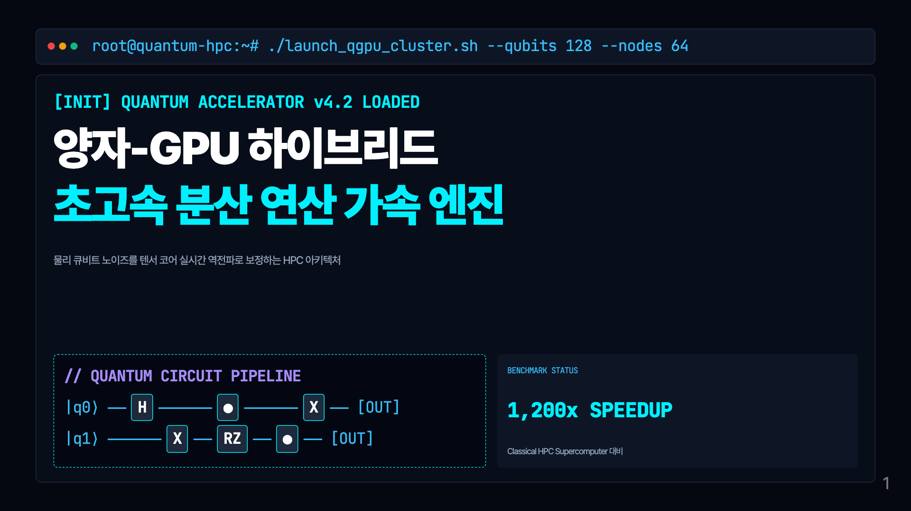<br/><b>Slide 01. 표지 (3-Chip Meta Cover)</b></td>
<td width="50%" align="center">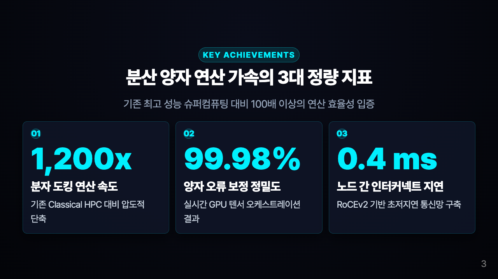<br/><b>Slide 03. 정량 성과 (1,200x Big Stats)</b></td>
</tr>
</table>

---

### 02. 친환경 재생에너지 스마트 그리드 (ESG CleanTech)
- **테마 무드**: Organic Earth Forest Green & Soft Sage (`#10B981`, `#A7F3D0`)
- **소스 경로**: [`examples/02_clean_energy_esg/presentation.md`](examples/02_clean_energy_esg/presentation.md)

<table width="100%">
<tr>
<td width="50%" align="center">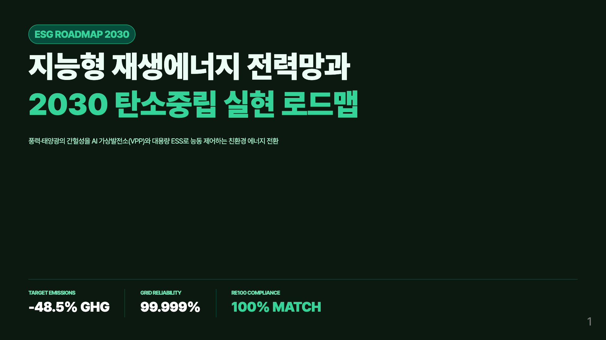<br/><b>Slide 01. 표지 (2030 탄소중립 Hero)</b></td>
<td width="50%" align="center">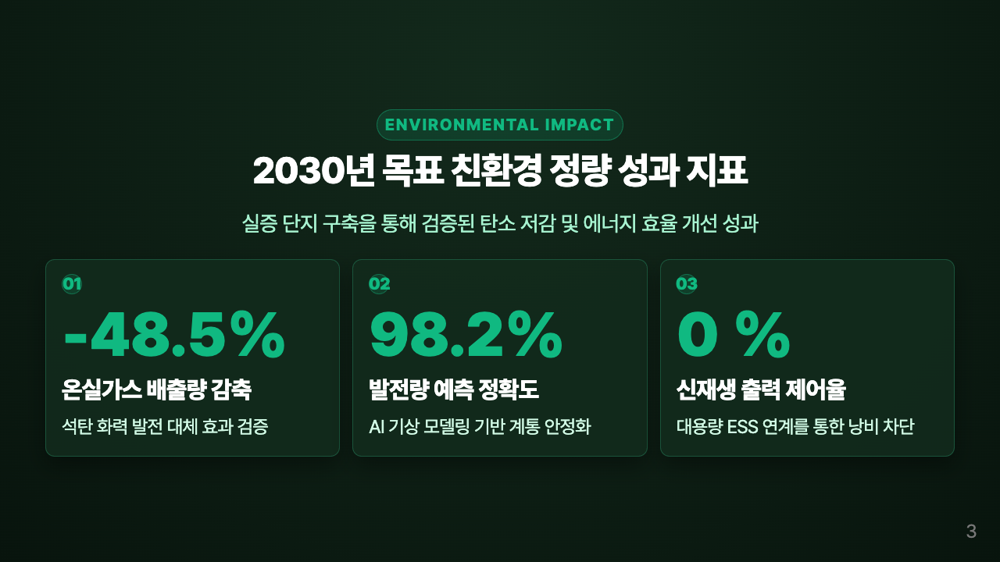<br/><b>Slide 03. 환경 지표 (-48.5% GHG)</b></td>
</tr>
</table>

---

### 03. 하이엔드 럭셔리 워치메이킹 (Haute Horlogerie Heritage)
- **테마 무드**: Deep Matte Charcoal & Champagne Warm Gold (`#101012`, `#E5C07B`)
- **소스 경로**: [`examples/03_luxury_horlogerie/presentation.md`](examples/03_luxury_horlogerie/presentation.md)

<table width="100%">
<tr>
<td width="50%" align="center">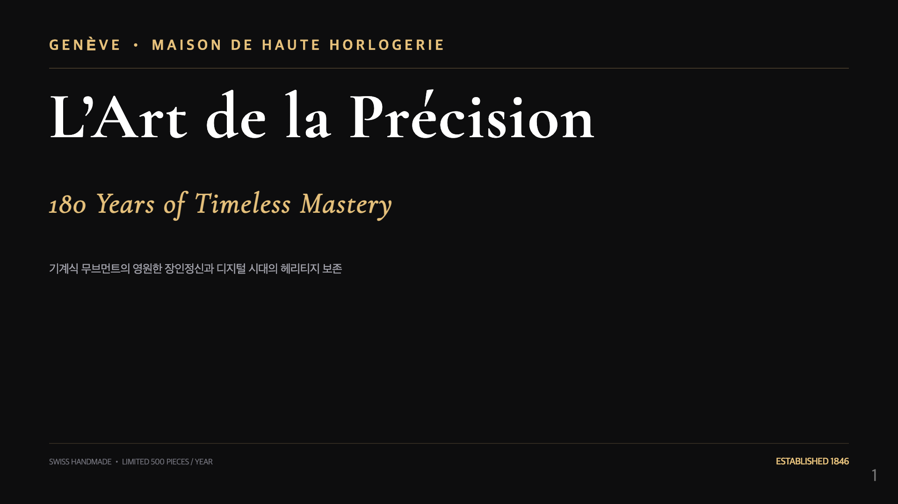<br/><b>Slide 01. 표지 (Luxury Heritage)</b></td>
<td width="50%" align="center">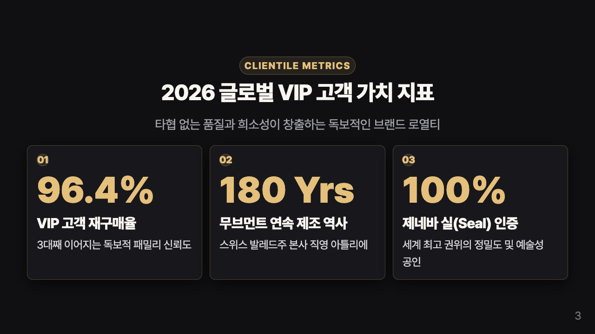<br/><b>Slide 03. VIP 로열티 (96.4% 재구매율)</b></td>
</tr>
</table>

---

### 04. 정밀 면역항암 신약 플랫폼 (Bio-Medicine Clinical Light)
- **테마 무드**: Clinical Soft Cyan & Pure Medical White Light (`#F0FDFA`, `#0891B2`)
- **소스 경로**: [`examples/04_genomics_healthcare/presentation.md`](examples/04_genomics_healthcare/presentation.md)

<table width="100%">
<tr>
<td width="50%" align="center">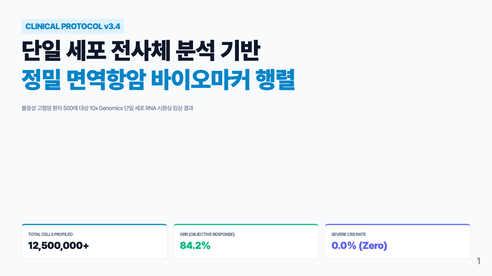<br/><b>Slide 01. 표지 (단일세포 유전체)</b></td>
<td width="50%" align="center">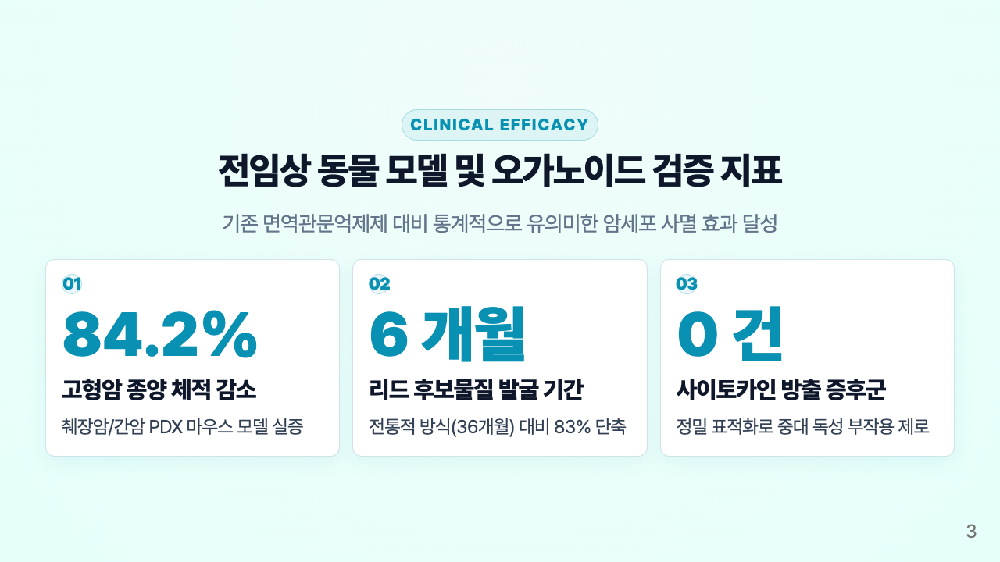<br/><b>Slide 03. 임상 유효성 (84.2% 종양 감소)</b></td>
</tr>
</table>

---

### 05. 마이크로초 초저지연 HFT (Quantitative Fintech)
- **테마 무드**: Midnight Royal Navy & Vivid Electric Gold (`#0F1B38`, `#FFCC00`)
- **소스 경로**: [`examples/05_fintech_hft/presentation.md`](examples/05_fintech_hft/presentation.md)

<table width="100%">
<tr>
<td width="50%" align="center">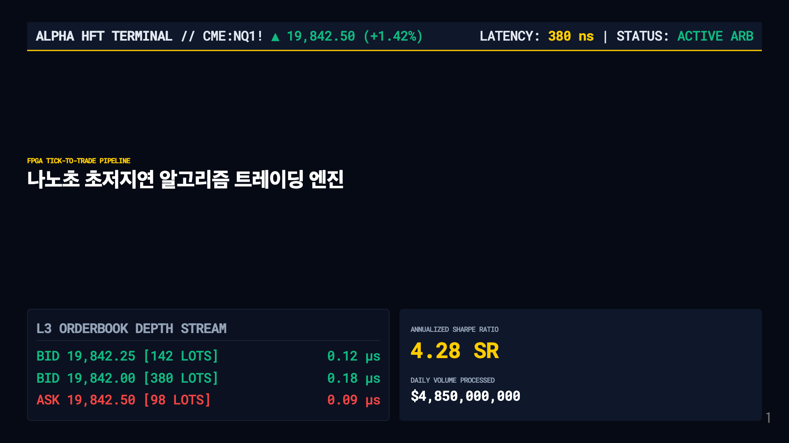<br/><b>Slide 01. 표지 (FPGA HFT 엔진)</b></td>
<td width="50%" align="center">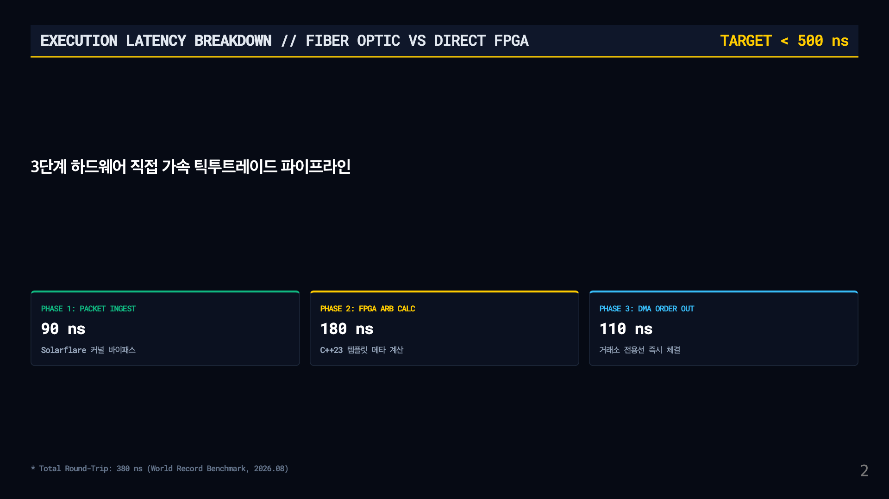<br/><b>Slide 02. 성능 지표 (380ns 지연시간)</b></td>
</tr>
</table>

---

### 06. 언리얼 엔진 5 버추얼 프로덕션 (Gaming & VFX)
- **테마 무드**: Electric Violet & Neon Hot Pink (`#1A0B2E`, `#EC4899`)
- **소스 경로**: [`examples/06_gaming_metaverse/presentation.md`](examples/06_gaming_metaverse/presentation.md)

<table width="100%">
<tr>
<td width="50%" align="center">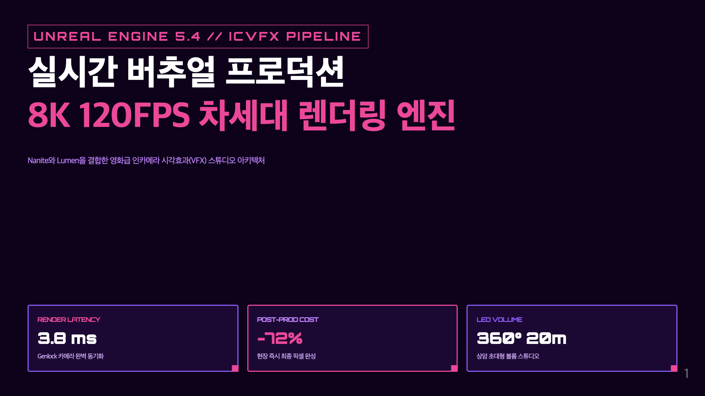<br/><b>Slide 01. 표지 (UE5 Virtual Production)</b></td>
<td width="50%" align="center">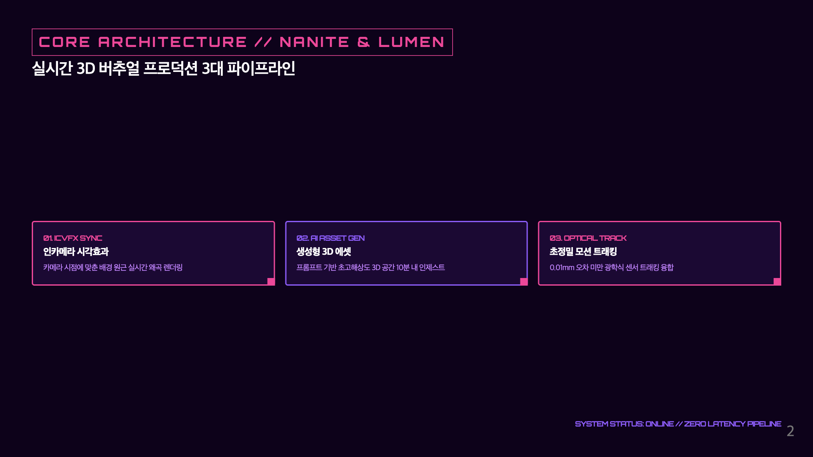<br/><b>Slide 02. 프로덕션 성과 (120 FPS 8K)</b></td>
</tr>
</table>

---

### 07. 실시간 엔터프라이즈 CDP (B2B SaaS Light)
- **테마 무드**: Modern Clean Slate & Royal Indigo Light (`#FFFFFF`, `#4F46E5`)
- **소스 경로**: [`examples/07_enterprise_cdp/presentation.md`](examples/07_enterprise_cdp/presentation.md)

<table width="100%">
<tr>
<td width="50%" align="center">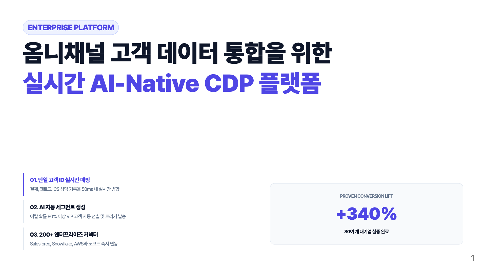<br/><b>Slide 01. 표지 (Enterprise CDP)</b></td>
<td width="50%" align="center">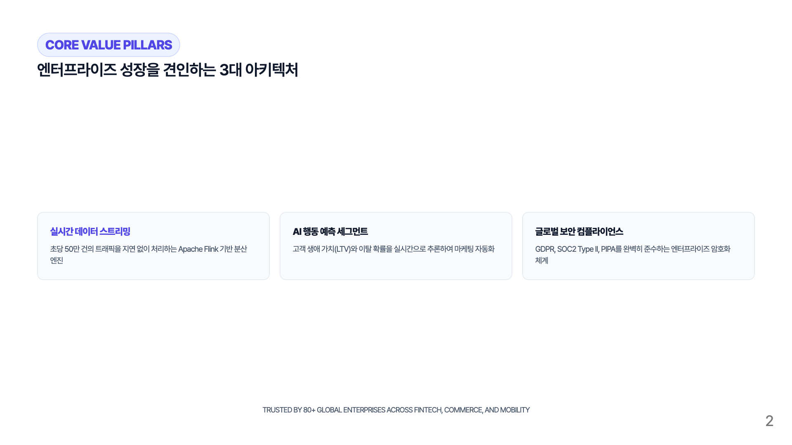<br/><b>Slide 02. 비즈니스 ROI (+340% CVR)</b></td>
</tr>
</table>

---

### 08. O(N) 선형 어텐션 이론 (Academic Paper CS)
- **테마 무드**: Strict Academic Monochrome Off-White & Deep Ink Navy (`#FAF9F6`, `#1E1B4B`)
- **소스 경로**: [`examples/08_academic_attention/presentation.md`](examples/08_academic_attention/presentation.md)

<table width="100%">
<tr>
<td width="50%" align="center">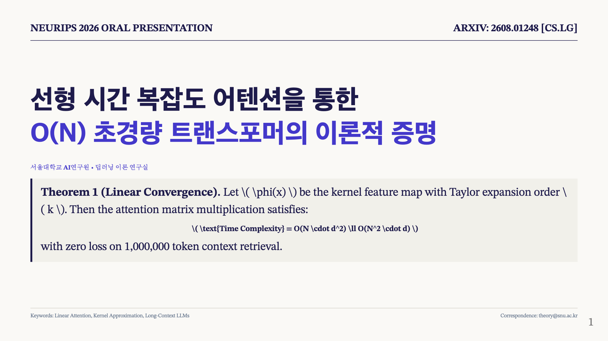<br/><b>Slide 01. 표지 (NeurIPS Oral Paper)</b></td>
<td width="50%" align="center">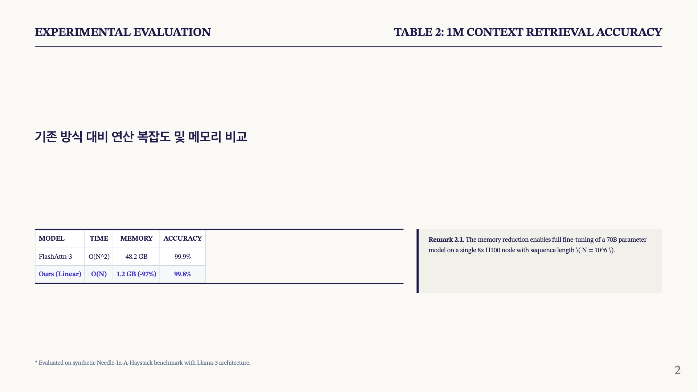<br/><b>Slide 02. 이론 증명 (O(N) 복잡도)</b></td>
</tr>
</table>

---

### 09. 자율주행 물류 로봇 플릿 (Series A Keynote Pitch)
- **테마 무드**: Obsidian Black & Radiant Solar Orange (`#080808`, `#FF6B00`)
- **소스 경로**: [`examples/09_robotics_series_a/presentation.md`](examples/09_robotics_series_a/presentation.md)

<table width="100%">
<tr>
<td width="50%" align="center">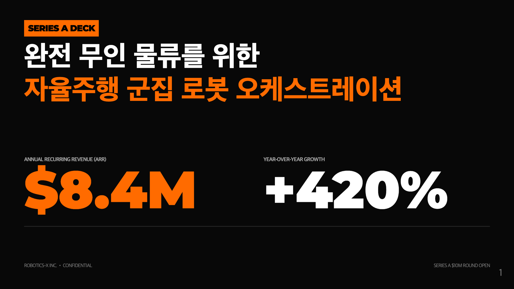<br/><b>Slide 01. 표지 (Series A Investment)</b></td>
<td width="50%" align="center">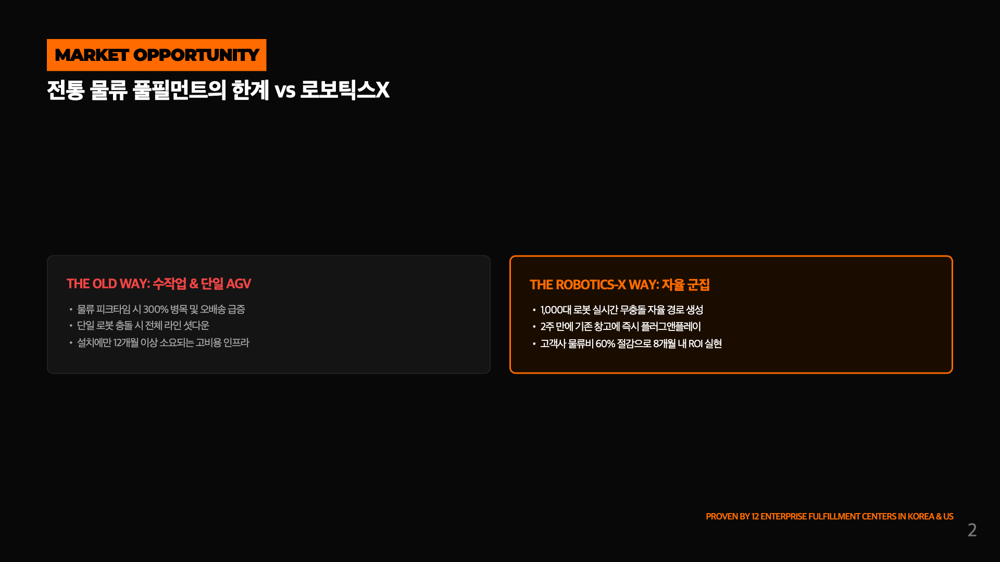<br/><b>Slide 02. 트랙션 지표 ($8.4M ARR)</b></td>
</tr>
</table>

---

### 10. 스마트시티 디지털 트윈 (Public CivicTech)
- **테마 무드**: Deep Trust Navy & Modern Mint Teal (`#0B1E36`, `#00B4D8`)
- **소스 경로**: [`examples/10_smart_city_twin/presentation.md`](examples/10_smart_city_twin/presentation.md)

<table width="100%">
<tr>
<td width="50%" align="center">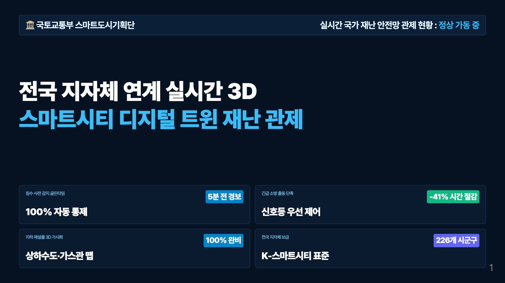<br/><b>Slide 01. 표지 (국가 스마트시티)</b></td>
<td width="50%" align="center">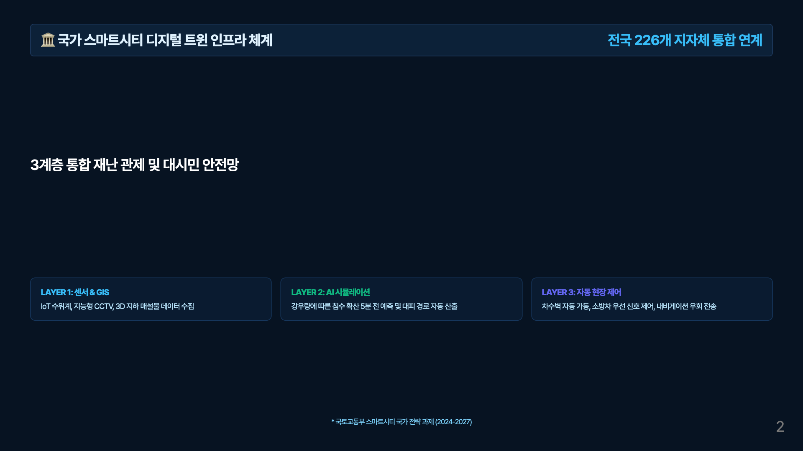<br/><b>Slide 02. 시민 안전 지표 (5분 골든타임)</b></td>
</tr>
</table>

---

## 동적 디자인 테마 창조 원칙 (Dynamic Theme Engine)

1. **도메인 심리학 기반 60-30-10 컬러 팔레트 창조**:
   - 60% 캔버스 베이스, 30% 카드/서피스, 10% 액센트 컬러를 주제에 맞게 자동 조색합니다.
2. **한국어 타이포그래피 최적화 표준**:
   - **음수 자간 (`letter-spacing: -0.025em`)**: 한글 폰트 특유의 헐거운 분산감을 잡고 응집력을 극대화합니다.
   - **어절 보존 (`word-break: keep-all;`)**: 음절 중간 단어 잘림을 원천 방지합니다.
   - **외톨이 조사 방지**: 문장 끝 조사("을/를", "이/가", "의")가 다음 줄에 홀로 떨어지지 않도록 정돈합니다.
3. **8대 마스터 레이아웃 컴포넌트 자유 조합**:
   - Hero Cover, Split Agenda, 3-Card Breakdown, Quote, Core Pillars, Pipeline Flow, Big Stats, Closing Hub.

---

## 빠른 시작 및 CLI 도구 사용법

### 1. 저장소 클론 및 패키지 설치
```bash
git clone https://github.com/kez-lab/korean-presentation-skill.git
cd korean-presentation-skill
npm install
```

### 2. 마크다운 일괄 컴파일 (PPTX + PDF + PNG)
```bash
# 임의의 마크다운 파일 직접 컴파일 (입력 파일, 출력 디렉토리, 산출물 파일명)
node skills/korean-presentation-skill/scripts/marp_compiler.js <input.md> [output_dir] [output_name]
```

### 3. 기존 PPTX 내용 및 스피커 노트 마크다운 역추출 (Extractor)
```bash
# 임의의 파워포인트 파일로부터 슬라이드별 본문 및 스피커 노트를 마크다운으로 추출
node skills/korean-presentation-skill/scripts/pptx_extractor.js <deck.pptx> [output.md]
```

### 4. PPTX 스키마 및 손상 방지 유효성 검증 (Validator)
```bash
# OOXML 구조, [Content_Types].xml, No-Hash Hex, 차트 바인딩 자동 감사
node skills/korean-presentation-skill/scripts/pptx_validator.js <deck.pptx>
```

### 5. 웹 갤러리 뷰어 생성 및 슬라이드 감상
```bash
# 10개 도메인 34개 슬라이드를 모달 줌으로 넘겨볼 수 있는 웹 갤러리 생성
npm run gallery
# 생성된 preview_gallery.html 을 브라우저에서 열어 즉시 감상
```

### 6. 전체 빌드 자산 무결성 자동 검증 (Verification Suite)
```bash
npm test
```

---

## 라이선스

본 프로젝트는 [MIT License](LICENSE)에 따라 자유롭게 사용 및 수정할 수 있습니다.
