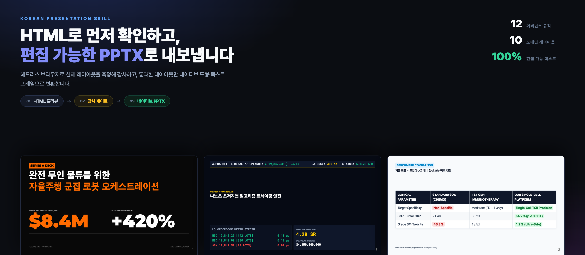
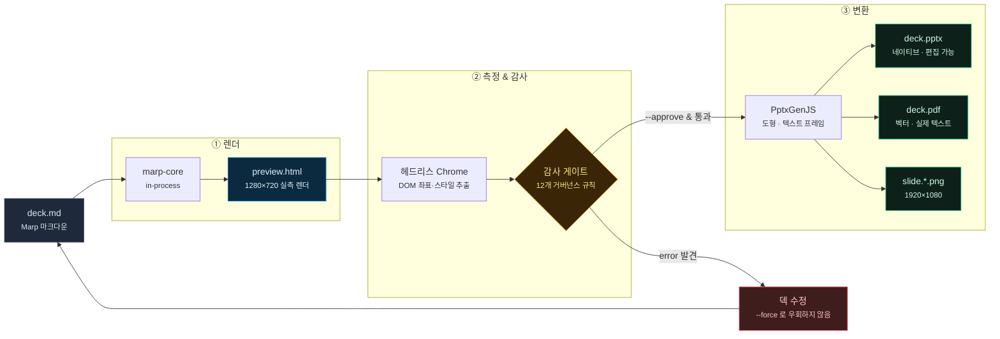

<div align="center">



# Korean Presentation Skill

### HTML-First 파이프라인으로 네이티브 편집 가능한 PPTX를 만드는 AI 프레젠테이션 엔진

[](https://github.com/kez-lab/korean-presentation-skill/actions/workflows/ci.yml)
[](package.json)
[](package.json)
[](LICENSE)

[](#2-html-first-파이프라인)
[](#2-html-first-파이프라인)
[](#감사-규칙)
[](#4-한국어-타이포그래피-최적화-표준)
[](https://github.com/google/antigravity)

<br/>

[**갤러리**](#1-10대-도메인-완전-차별화-레이아웃-쇼케이스-갤러리) •
[**파이프라인**](#2-html-first-파이프라인) •
[**테마 엔진**](#3-동적-디자인-테마-창조-원칙-dynamic-theme-engine) •
[**타이포그래피**](#4-한국어-타이포그래피-최적화-표준) •
[**빠른 시작**](#5-빠른-시작-및-cli-도구-사용법) •
[**기여**](CONTRIBUTING.md) •
[**변경 이력**](CHANGELOG.md)

</div>

---

## 개요 (Overview)

`korean-presentation-skill`은 Google Antigravity, Claude Code, OpenAI Codex, Cursor 등 최신 자율형 AI 코딩 에이전트를 위해 개발된 프레젠테이션 생성 및 검증 통합 AI 스킬입니다.

산출되는 `.pptx`는 슬라이드 이미지를 붙인 껍데기가 아니라 **실제 도형과 텍스트 프레임으로 구성된 완전 편집 가능한 네이티브 파일**입니다. 파워포인트에서 글자를 고치고, 검색하고, 번역하고, 스크린리더로 읽을 수 있습니다.

**천편일률적인 카드 박스 복사를 완전히 지양합니다.** 주제의 성격에 따라 **터미널 CLI, 수평 타임라인, 스위스 에디토리얼 세리프, 임상 비교 매트릭스 테이블, 금융 L3 호가창, 사이버펑크 HUD, SaaS 아코디언, 논문 수식 조판, 볼드 피치, 관제 대시보드** 등 완전히 고유한 비주얼 컴포넌트와 레이아웃을 동적으로 창조합니다.

---

## 60초 안에 시작하기

```bash
git clone https://github.com/kez-lab/korean-presentation-skill.git
cd korean-presentation-skill && npm ci

# ① 리뷰 — HTML 프리뷰 + 감사. 아직 PPTX는 만들지 않습니다.
node skills/korean-presentation-skill/scripts/build_deck.js examples/09_robotics_series_a/presentation.md --out dist
open dist/presentation.preview.html

# ② 승인 — 감사를 통과하면 네이티브 PPTX로 변환합니다.
node skills/korean-presentation-skill/scripts/build_deck.js examples/09_robotics_series_a/presentation.md \
     --out dist --approve --pdf --png --safe-fonts
```

> Node 18 이상과 Chrome(또는 Chromium)이 필요합니다. 파이프라인이 헤드리스 브라우저에서 실제 레이아웃 좌표를 측정하기 때문입니다.
> 자동 탐색에 실패하면 `CHROME_PATH` 로 지정할 수 있습니다.

---

## 1. 10대 도메인 완전 차별화 레이아웃 쇼케이스 갤러리

> **Interactive Gallery**: 모든 슬라이드를 1920×1080 고화질 모달 줌으로 감상하려면 `npm run gallery`를 실행하여 `preview_gallery.html`을 열어보세요.

---

### 01. 양자 컴퓨팅 (Quantum DeepTech)
`CYBER TERMINAL` • `JETBRAINS MONO` • `#00F0FF CYAN` • [`소스 코드 보기`](examples/01_quantum_gpu/presentation.md)
* **비주얼 특징**: 터미널 타이틀바, 양자 회로 게이트 다이어그램, 1,200x 슈퍼컴 비교표

<table width="100%">
<tr>
<td width="50%" align="center">
<br/>
<sub><b>Slide 01. 터미널 프롬프트 & 회로도 파이프라인</b></sub>
</td>
<td width="50%" align="center">
<br/>
<sub><b>Slide 02. 하드웨어 레지스터 벤치마크 비교표</b></sub>
</td>
</tr>
</table>

---

### 02. 친환경 스마트 그리드 (ESG CleanTech)
`EDITORIAL GREEN` • `HORIZONTAL TIMELINE` • `#10B981 EMERALD` • [`소스 코드 보기`](examples/02_clean_energy_esg/presentation.md)
* **비주얼 특징**: 에코 그린 캔버스, 2026~2030 단계별 수평 타임라인 바, 마일스톤 노드

<table width="100%">
<tr>
<td width="50%" align="center">
<br/>
<sub><b>Slide 01. 2030 탄소중립 Hero & 3대 핵심 지표</b></sub>
</td>
<td width="50%" align="center">
<br/>
<sub><b>Slide 02. '26 ➔ '28 ➔ '30 수평 로드맵 타임라인</b></sub>
</td>
</tr>
</table>

---

### 03. 하이엔드 럭셔리 워치메이킹 (Haute Horlogerie)
`SWISS HAUTE` • `CORMORANT GARAMOND SERIF` • `#E5C07B GOLD` • [`소스 코드 보기`](examples/03_luxury_horlogerie/presentation.md)
* **비주얼 특징**: Cormorant 대형 세리프 타이포그래피, 얇은 골드 헤어라인, 에디토리얼 인용구

<table width="100%">
<tr>
<td width="50%" align="center">
<br/>
<sub><b>Slide 01. 대형 세리프 타이포그래피 에디토리얼 표지</b></sub>
</td>
<td width="50%" align="center">
<br/>
<sub><b>Slide 02. 장인 철학 인용구 & 2단 디테일</b></sub>
</td>
</tr>
</table>

---

### 04. 정밀 면역항암 신약 (Bio-Medicine)
`CLINICAL MATRIX` • `HIGH-CONTRAST LIGHT` • `#0284C7 BLUE` • [`소스 코드 보기`](examples/04_genomics_healthcare/presentation.md)
* **비주얼 특징**: 클리니컬 화이트 캔버스, 대조군 vs 치료법 임상 행렬 비교표(PASS/FAIL 뱃지)

<table width="100%">
<tr>
<td width="50%" align="center">
<br/>
<sub><b>Slide 01. 임상 프로토콜 헤더 & 3단 반응률 지표</b></sub>
</td>
<td width="50%" align="center">
<br/>
<sub><b>Slide 02. 표준 치료법(SoC) 대비 임상 효능 비교 행렬</b></sub>
</td>
</tr>
</table>

---

### 05. 마이크로초 초저지연 HFT (Fintech Trading)
`BLOOMBERG TERMINAL` • `ROBOTO MONO` • `#FFCC00 GOLD` • [`소스 코드 보기`](examples/05_fintech_hft/presentation.md)
* **비주얼 특징**: 실시간 오더북 Depth 스트림, 티커 바, 380ns 틱투트레이드 파이프라인

<table width="100%">
<tr>
<td width="50%" align="center">
<br/>
<sub><b>Slide 01. 금융 티커 & L3 오더북 Depth 스트림</b></sub>
</td>
<td width="50%" align="center">
<br/>
<sub><b>Slide 02. 나노초(ns) 3단계 틱투트레이드 파이프라인</b></sub>
</td>
</tr>
</table>

---

### 06. 언리얼 엔진 5 버추얼 프로덕션 (Gaming & VFX)
`CYBERPUNK HUD` • `ORBITRON NEON` • `#EC4899 PINK` • [`소스 코드 보기`](examples/06_gaming_metaverse/presentation.md)
* **비주얼 특징**: Orbitron 미래형 폰트, 사선 컷아웃 HUD 카드, 8K 120 FPS ICVFX 스펙

<table width="100%">
<tr>
<td width="50%" align="center">
<br/>
<sub><b>Slide 01. 사이버 HUD 카드 & 120 FPS 렌더링 지표</b></sub>
</td>
<td width="50%" align="center">
<br/>
<sub><b>Slide 02. 실시간 ICVFX 3대 아키텍처 스택</b></sub>
</td>
</tr>
</table>

---

### 07. 실시간 엔터프라이즈 CDP (B2B SaaS)
`LINEAR SAAS` • `STEP ACCORDION` • `#4F46E5 INDIGO` • [`소스 코드 보기`](examples/07_enterprise_cdp/presentation.md)
* **비주얼 특징**: 3단계 수직 스텝 아코디언 바, 우측 데이터 리프트 박스(+340% CVR)

<table width="100%">
<tr>
<td width="50%" align="center">
<br/>
<sub><b>Slide 01. 인터랙티브 스텝 아코디언 UI & ROI 박스</b></sub>
</td>
<td width="50%" align="center">
<br/>
<sub><b>Slide 02. 3대 엔터프라이즈 아키텍처 기둥</b></sub>
</td>
</tr>
</table>

---

### 08. O(N) 선형 어텐션 이론 (Academic Paper)
`LATEX PAPER` • `STIX TWO TEXT` • `#1E1B4B INK NAVY` • [`소스 코드 보기`](examples/08_academic_attention/presentation.md)
* **비주얼 특징**: NeurIPS 논문 헤더, Theorem 1 수식 박스, 1M 토큰 메모리 벤치마크 표

<table width="100%">
<tr>
<td width="50%" align="center">
<br/>
<sub><b>Slide 01. 학술 논문 헤더 & Theorem 수식 조판 박스</b></sub>
</td>
<td width="50%" align="center">
<br/>
<sub><b>Slide 02. 1M 토큰 메모리 & 연산 복잡도 비교표</b></sub>
</td>
</tr>
</table>

---

### 09. 자율주행 물류 로봇 (Series A Pitch)
`GIANT IMPACT BOLD` • `MONTSERRAT` • `#FF6B00 ORANGE` • [`소스 코드 보기`](examples/09_robotics_series_a/presentation.md)
* **비주얼 특징**: 거대 볼드 수치($8.4M ARR, +420%), 1:1 Old Way vs Robotics-X 대조 박스

<table width="100%">
<tr>
<td width="50%" align="center">
<br/>
<sub><b>Slide 01. 초대형 볼드 폰트 ARR 트랙션 표지</b></sub>
</td>
<td width="50%" align="center">
<br/>
<sub><b>Slide 02. 1:1 문제점(Old) vs 솔루션(New) 극적 대조</b></sub>
</td>
</tr>
</table>

---

### 10. 스마트시티 디지털 트윈 (GovTech)
`CIVIC DASHBOARD` • `4-WIDGET GRID` • `#38BDF8 MINT TEAL` • [`소스 코드 보기`](examples/10_smart_city_twin/presentation.md)
* **비주얼 특징**: 국토부 상황실 헤더, 4분할 실시간 관제 위젯, 3계층 국가 재난안전망 트리

<table width="100%">
<tr>
<td width="50%" align="center">
<br/>
<sub><b>Slide 01. 4분할 실시간 상황실 관제 대시보드</b></sub>
</td>
<td width="50%" align="center">
<br/>
<sub><b>Slide 02. 3계층 통합 국가 재난안전망 인프라</b></sub>
</td>
</tr>
</table>

---

## 2. HTML-First 파이프라인

덱을 곧바로 PPTX로 내보내지 않습니다. **HTML로 먼저 렌더링해 눈으로 확인하고, 기계 검수를 통과한 레이아웃만 PPTX로 변환**합니다.



| 단계 | 산출물 | 하는 일 |
|------|--------|---------|
| ① 렌더 | `<name>.preview.html` | 전 슬라이드를 실제 1280×720으로 렌더한 리뷰 페이지. 컨택트시트/전체폭 전환, 슬라이드별 이슈 목록, 스피커 노트를 한 화면에 |
| ② 감사 | 콘솔 리포트 + `<name>.audit.json` | 헤드리스 크롬으로 **실제 레이아웃 좌표를 측정**해 12개 거버넌스 규칙 검사. `error`가 있으면 변환 차단 |
| ③ 변환 | `<name>.pptx` | 측정된 동일 레이아웃을 **네이티브 도형·텍스트 프레임**으로 기록 |

### 왜 바꿨나

기존 경로(`marp-cli`의 PPTX 익스포트)는 슬라이드마다 **배경 이미지 한 장과 빈 도형 트리**를 썼습니다. 보기에는 멀쩡하지만 실제로는 그림 파일에 가까웠습니다.

| | 기존 (marp-cli 익스포트) | 현재 (`build_deck.js`) |
|---|---|---|
| 슬라이드 구성 | 배경 PNG 1장 + 빈 `<p:spTree>` | 네이티브 도형 + 텍스트 프레임 |
| 편집 가능한 텍스트 런 | **0개** | 슬라이드당 수십 개 |
| 2슬라이드 덱 파일 크기 | ~421 KB | **~66 KB** |
| 텍스트 추출 · 검색 · 번역 | 불가 | 가능 |
| 스크린리더 접근성 | 불가 | 가능 |
| 레이아웃 품질 검사 | 없음 (파일 존재 여부만 확인) | 12개 규칙 자동 감사 |

### 감사 규칙

| 규칙 | 수준 | 내용 |
|------|------|------|
| `canvas-overflow` | error | 콘텐츠가 1280×720 밖으로 넘쳐 PPTX에서 잘림 |
| `low-contrast` | error/warn | 실제로 뒤에 칠해진 배경 대비 WCAG AA 미달 |
| `empty-slide` | error | 텍스트·이미지가 전혀 없는 슬라이드 |
| `korean-orphan` | warn | 마지막 줄에 1~2글자 또는 조사만 홀로 남음 |
| `letter-spacing` | warn | 한글 블록 자간이 -0.025em 기준에서 벗어남 |
| `word-break` | warn | 한글 블록에 `keep-all` 미적용 |
| `font-too-small` | warn | 11px 미만이라 투사 시 판독 불가 |
| `unsafe-font` | warn | PowerPoint 기본 환경에 없는 웹폰트 |
| `text-collision` | warn | 텍스트 블록끼리 30% 이상 겹침 |
| `vertical-imbalance` | warn | 상·하 여백 차이가 캔버스의 28% 초과 |
| `missing-notes` | warn | 스피커 노트 없음 |
| `gradient-approximated` | info | CSS 그라디언트가 PPTX 단색으로 근사됨 |

> 이 감사는 실제로 결함을 잡아냅니다. 도입 직후 기존 예제 덱 10종에서 **20건의 blocking 오류**가 발견됐고 (대표적으로 어두운 덱 위에 Marp 기본 흰색 테이블이 겹쳐 본문이 1.2:1 대비로 사실상 보이지 않던 문제), 전부 수정한 뒤 재빌드했습니다.

---

## 3. 동적 디자인 테마 창조 원칙 (Dynamic Theme Engine)

1. **도메인 심리학 기반 60-30-10 컬러 팔레트 창조**:
   - 60% 캔버스 베이스, 30% 카드/서피스, 10% 액센트 컬러를 주제에 맞게 자동 조색합니다.
2. **도메인 전용 비주얼 폼(Form) 동적 채택**:
   - 엔지니어링 ➔ 터미널 & 코드 블록
   - 로드맵 / 전략 ➔ 수평 타임라인
   - 럭셔리 / 브랜딩 ➔ 대형 세리프 에디토리얼
   - 의학 / 연구 ➔ 임상 비교 행렬 표
   - 금융 / 트레이딩 ➔ 오더북 Depth 터미널
   - 게임 / 미디어 ➔ 사이버 HUD
   - 학술 ➔ Theorem 수식 조판
   - 스타트업 피치 ➔ 자이언트 볼드 임팩트
3. **한국어 타이포그래피 최적화 표준**:
   - **음수 자간 (`letter-spacing: -0.025em`)**: 한글 폰트 특유의 헐거운 분산감을 잡고 응집력을 극대화합니다.
   - **어절 보존 (`word-break: keep-all;`)**: 음절 중간 단어 잘림을 원천 방지합니다.
   - **외톨이 조사 방지**: 문장 끝 조사("을/를", "이/가", "의")가 다음 줄에 홀로 떨어지지 않도록 정돈합니다.

---

## 4. 한국어 타이포그래피 최적화 표준

- **음수 자간 (`letter-spacing: -0.025em`)**: 정방형 한글 폰트의 헐거운 분산감을 제거하고 고밀도 텍스트 응집력을 제공합니다.
- **어절 보존 (`word-break: keep-all;`)**: 한글 단어가 음절 중간에서 부자연스럽게 잘리지 않도록 강제합니다.
- **외톨이 조사 고립 방지**: 문장 끝의 조사("은/는/이/가/을/를/의/에")가 다음 줄에 홀로 떨어지지 않도록 의미 단위 줄바꿈을 적용합니다.
- **모듈러 행간 스케일**: 메인 타이틀 `1.28`, 섹션 제목 `1.32`, 본문 `1.55`.

---

## 5. 빠른 시작 및 CLI 도구 사용법

### 1. 저장소 클론 및 패키지 설치
```bash
git clone https://github.com/kez-lab/korean-presentation-skill.git
cd korean-presentation-skill
npm install
```

### 2. 리뷰 단계 — HTML 프리뷰 + 감사
```bash
node skills/korean-presentation-skill/scripts/build_deck.js <deck.md> --out dist
```
`dist/<name>.preview.html`을 브라우저로 열어 확인하고, 콘솔 감사 리포트의 `error`를 모두 해소합니다. 이 단계에서는 PPTX를 만들지 않습니다.

### 3. 승인 단계 — 네이티브 PPTX 변환
```bash
node skills/korean-presentation-skill/scripts/build_deck.js <deck.md> --out dist \
     --approve --pdf --png --safe-fonts
```

| 옵션 | 설명 |
|------|------|
| `--approve` | 감사 게이트를 통과하면 PPTX 생성 |
| `--strict` | `warn`도 차단 대상으로 승격 |
| `--force` | 게이트 실패를 무시하고 강행 (권장하지 않음) |
| `--pdf` / `--png` | 벡터 PDF(실제 텍스트) / 1920×1080 PNG 동시 생성 |
| `--json` | `<name>.audit.json` 기록 |
| `--safe-fonts` | 웹 전용 폰트를 PowerPoint 기본 서체로 치환 (Pretendard→Malgun Gothic 등) |
| `--font-map A=B` | 개별 폰트 치환. macOS 배포 시 `"Pretendard=Apple SD Gothic Neo"` |

### 4. 기존 PPTX 내용 및 스피커 노트 마크다운 역추출 (Extractor)
```bash
# 임의의 파워포인트 파일로부터 슬라이드별 본문 및 스피커 노트를 마크다운으로 추출
node skills/korean-presentation-skill/scripts/pptx_extractor.js <deck.pptx> [output.md]
```

### 5. PPTX 스키마 · 편집 가능성 검증 (Validator)
```bash
# OOXML 구조, [Content_Types].xml, No-Hash Hex 검사에 더해
# "슬라이드가 통짜 이미지인지" — 즉 편집 불가능한 덱인지 — 를 탐지합니다
node skills/korean-presentation-skill/scripts/pptx_validator.js <deck.pptx>
```

### 6. 웹 갤러리 뷰어 생성 및 슬라이드 감상
```bash
# 10개 도메인 고유 구조 슬라이드를 모달 줌으로 넘겨볼 수 있는 웹 갤러리 생성
npm run gallery
# 생성된 preview_gallery.html 을 브라우저에서 열어 즉시 감상
```

### 7. 전체 재빌드 및 무결성 자동 검증
```bash
npm run build:examples   # 예제 10종을 파이프라인 전체로 재빌드
npm test                 # 전 덱 재렌더 → 감사 → PPTX 편집 가능성까지 검증
```
`npm test`는 파일 존재 여부만 보지 않습니다. 모든 예제 덱을 다시 렌더링해 감사 게이트를 통과하는지, 그리고 커밋된 `.pptx`가 실제 텍스트 런을 담고 있는지 확인합니다.

---

## 6. 프로젝트 구조

```
korean-presentation-skill/
├── skills/korean-presentation-skill/
│   ├── SKILL.md                    # AI 에이전트가 읽는 스킬 정의
│   ├── references/                 # 레이아웃 카탈로그, 타이포그래피 가이드, 디자인 시스템
│   └── scripts/
│       ├── build_deck.js           # ★ 파이프라인 진입점 (2단계 CLI)
│       ├── lib/
│       │   ├── deck.js             #   마크다운 → 슬라이드 HTML + CSS + 스피커 노트
│       │   ├── browser.js          #   헤드리스 Chrome 탐색 및 페이지 수명 관리
│       │   ├── extract.js          #   렌더된 DOM → 도형·텍스트·이미지 디스플레이 리스트
│       │   ├── audit.js            #   12개 거버넌스 규칙 검사
│       │   ├── pptx.js             #   디스플레이 리스트 → 네이티브 PPTX
│       │   └── constants.js        #   캔버스 좌표계, 폰트 폴백, 임계값
│       ├── pptx_extractor.js       # 기존 PPTX → 마크다운 역추출
│       ├── pptx_validator.js       # OOXML 스키마 + 편집 가능성 검증
│       └── marp_compiler.js        # (deprecated) build_deck.js 로 위임
├── examples/                       # 10개 도메인 예제 덱 + 산출물
├── templates/                      # 4종 스타터 템플릿
├── themes/                         # 공용 Marp 테마 CSS
└── scripts/
    ├── build_examples.js           # 예제·템플릿 일괄 재빌드
    ├── verify_all.js               # 무결성 테스트 스위트 (npm test)
    └── generate_gallery_viewer.js  # 웹 갤러리 생성
```

### 좌표계

덱은 1280×720 CSS 픽셀로 작성하고, PowerPoint 의 16:9 와이드는 13.333in × 7.5in 입니다. 이 대응이 **정확히 96 px/in, 0.75 pt/px** 이기 때문에 HTML 프리뷰와 PPTX 가 어긋나지 않습니다. 이 관계는 `lib/constants.js` 에 고정돼 있습니다.

---

## 기여하기

버그 제보, 새로운 레이아웃, 감사 규칙 제안 모두 환영합니다. [기여 가이드](CONTRIBUTING.md)를 먼저 읽어주세요.

특히 이 저장소에는 타협하지 않는 규칙이 있습니다.

1. **래스터 덱은 커밋하지 않습니다** — 슬라이드가 통짜 이미지인 `.pptx` 는 편집·검색·접근성이 전부 불가능합니다.
2. **감사 게이트를 `--force` 로 우회하지 않습니다** — `error` 가 뜨면 원인을 고칩니다.
3. **눈으로 먼저 확인합니다** — `.preview.html` 을 열어보지 않고 PPTX 를 만들지 않습니다.

---

## 라이선스

본 프로젝트는 [MIT License](LICENSE)에 따라 자유롭게 사용 및 수정할 수 있습니다.
