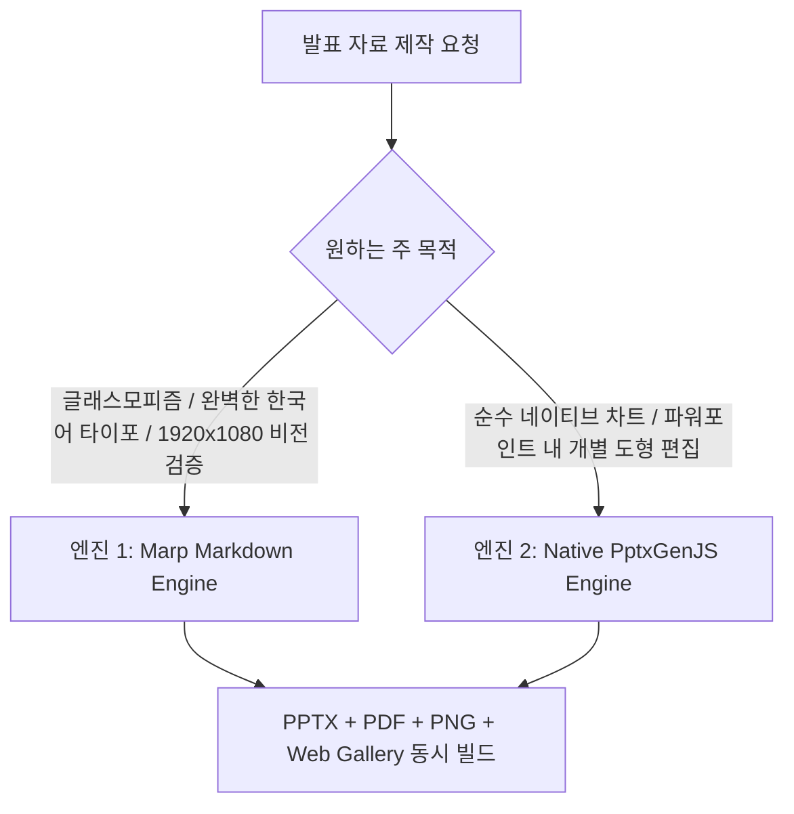

# Anthropic Official PPTX Skill Synthesis & Dual-Engine Architecture

본 문서는 **Anthropic 공식 PPTX 스킬 (`anthropics/skills/pptx`)**의 핵심 메커니즘과 베스트 프랙티스를 심층 분석하고, `korean-presentation-skill`의 **듀얼 엔진 (Marp CSS Grid + Native PptxGenJS)** 아키텍처에 융합한 기술 표준을 정의합니다.

---

## 1. Anthropic 공식 PPTX 스킬 핵심 분석 및 비교

| 영역 | Anthropic 공식 `pptx` 스킬 | Korean Presentation Skill (본 스킬) |
| :--- | :--- | :--- |
| **핵심 생성 엔진** | `pptxgenjs` (Node.js) / `python-pptx` | **Marp Core (CSS Grid & Flexbox) + PptxGenJS 듀얼 엔진** |
| **한국어 타이포 최적화** | 미지원 (영문 기본, 헐거운 자간 및 음절 쪼개짐) | **완벽 지원 (-0.025em 자간, keep-all, 외톨이 단어 방지)** |
| **디자인 시스템** | 단색 기본 도형 위주 | **다크 글래스모피즘, 24px 네온 서클 뱃지, 60-30-10 컬러 룰** |
| **레이아웃 제어** | X/Y 인치 좌표 수동 계산 (`10" × 5.625"`) | **반응형 16:9 8pt 그리드 & 비대칭 분할 카탈로그** |
| **산출물 및 검증** | PPTX 중심 + LibreOffice 변환 PDF | **네이티브 PPTX + 벡터 PDF + 1920x1080 PNG + 브라우저 갤러리** |

---

## 2. Anthropic PptxGenJS 핵심 지침 및 함정(Footguns) 융합

Anthropic 공식 가이드라인에서 규정한 PptxGenJS 주의사항을 본 스킬의 보조 생성기(`scripts/pptx_generator.js`)에 전면 반영하였습니다:

1. **캔버스 레이아웃 (Canvas Layout)**:
   - 기본 `LAYOUT_16x9` (10" × 5.625") 대신 `LAYOUT_WIDE` (13.3" × 7.5") 또는 16:9 와이드 비율을 명시.
2. **HEX 컬러 포맷 (No Hash Rule)**:
   - PptxGenJS에서는 `#`을 붙이거나 8자리 알파값을 넣으면 파일이 손상됩니다(`color: "00F0FF"`, `"#"` 제거 필수).
   - 반투명 처리는 `transparency: 0~100` 옵션 사용.
3. **옵션 객체 인라인 생성**:
   - PptxGenJS는 첫 렌더링 시 내부적으로 값을 EMU 단위로 변환하므로, 여러 `addText`/`addShape` 간에 동일한 `shadow`/`options` 객체를 재사용하지 않고 매번 독립 객체로 생성.
4. **리스트 및 불릿 규칙**:
   - `bullet: true` 옵션을 사용하며, 유니코드 `•` 문자를 직접 넣지 않음(중복 불릿 렌더링 방지).
   - 단락 간격은 `lineSpacing` 대신 `paraSpaceAfter`로 제어.
5. **스피커 노트 (Speaker Notes)**:
   - 슬라이드 내 텍스트 박스가 아닌 `slide.addNotes("발표 대본")` API를 통해 전용 노트 스트림에 주입.

---

## 3. 듀얼 엔진 선택 가이드 (Dual Engine Selection)

1. **엔진 1 (Marp Markdown Engine - 권장 기본값)**:
   - 아름다운 다크 글래스모피즘, 정교한 비대칭 레이아웃, 완벽한 한국어 어절 분절 및 외톨이 단어 제어가 필요한 엔터프라이즈 IR, 기술 세션, 학술 발표에 최적.
   - `node skills/korean-presentation-skill/scripts/marp_compiler.js <file.md>`
2. **엔진 2 (Native PptxGenJS Engine)**:
   - 파워포인트 내에서 각 도형과 네이티브 엑셀 차트 데이터를 직접 마우스로 수정해야 하는 환경에 최적.
   - `node scripts/pptx_generator.js --title "제목" --out deck.pptx`
